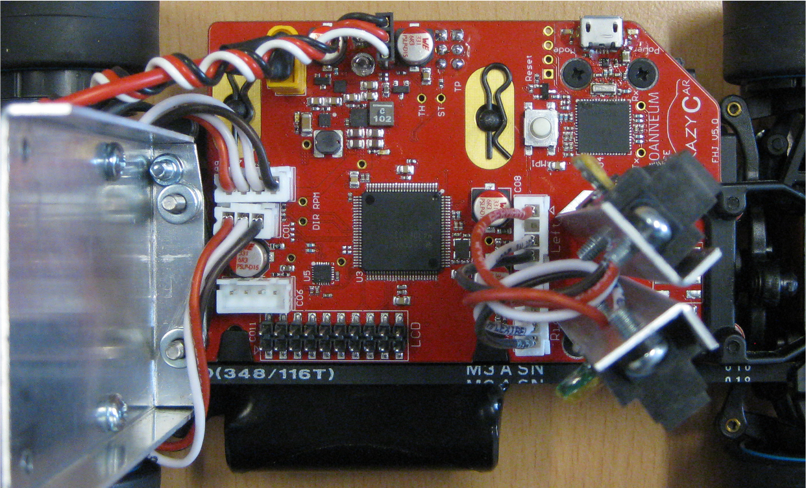
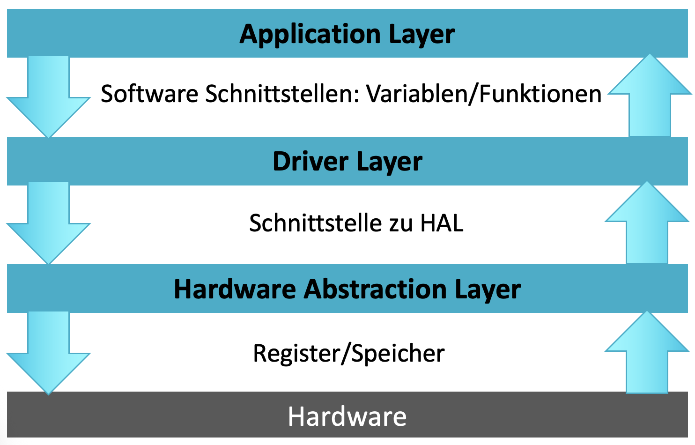
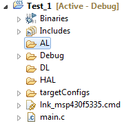
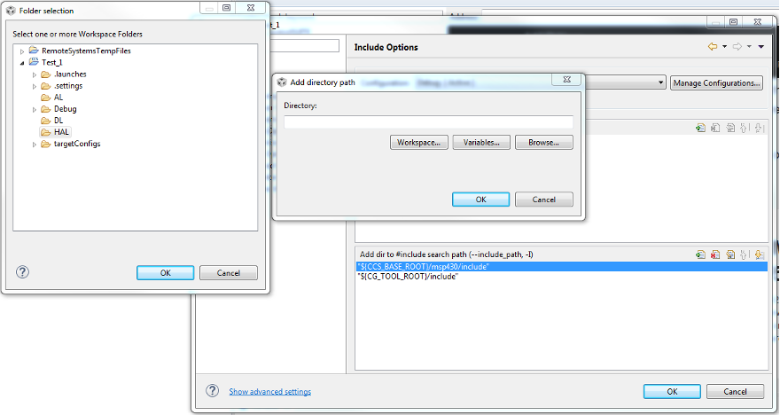
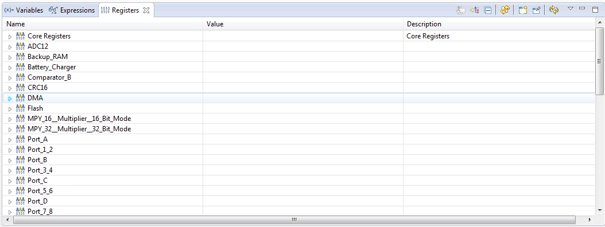
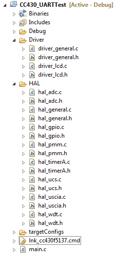
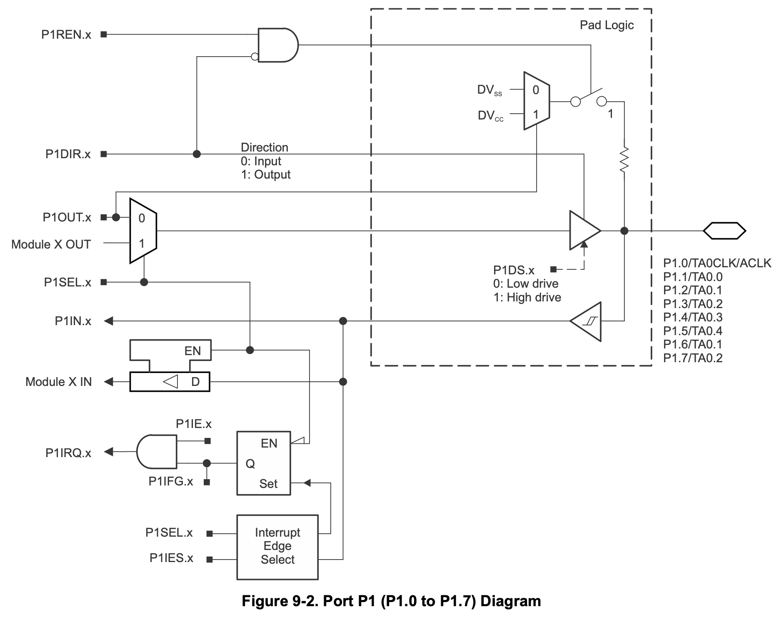
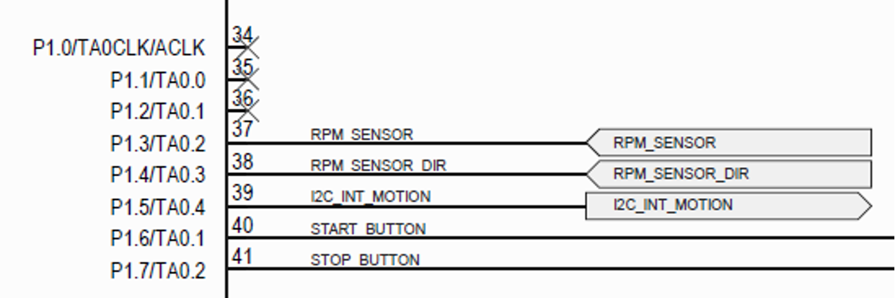

[⬅ Zurück zur Kapitelübersicht](../README.md#kapitelübersicht--aufgabenstellungen)

# Crazy Car Platine – Einführung, I/O-Port Konfiguration

## Inhalt

- [Crazy Car Platine](#crazy-car-platine)
- [Softwarestruktur](#softwarestruktur)
- [Code Composer Studio](#code-composer-studio)
- [Anlegen eines Basis Projektes](#anlegen-eines-basis-projektes)
- [Schnittstellen zwischen Softwaremodulen](#schnittstellen-zwischen-softwaremodulen)
- [IO Port Konfiguration](#io-port-konfiguration)
### Durchzuführende Aufgaben
- [[AUFGABE] Anlegen eines Basis Projektes](#aufgabe-anlegen-eines-basis-projektes)
- [[AUFGABE] Grundkonfiguration der GPIOs](#aufgabe-grundkonfiguration-der-gpio)

### Unterlagen
- [Family Guide - Digital I/O Ports Chapter 12](https://e2e.ti.com/cfs-file/__key/communityserver-discussions-components-files/166/MSP430x6-Family-User-Guide.pdf#page=408)

## Crazy Car Platine

- MSP430F5335
- 3 analoge Eingänge für Abstandssensoren
- 1 Hall-Effekt-Sensor für Drehzahl/Drehrichtungsmessung der Hinterachse
- MPU-9250: 9-Achsen-Sensor (Beschleunigung, Gyroskop, Kompass)
- Start/Stop-Taste
- Ausgänge für Servo und Fahrtenregler
- LC-Display
- JTAG Spy-by-wire Interface

<p align="center">
  
</p>

---

## Softwarestruktur

Die Software wird in Form eines klaren Layermodells entwickelt, das eine saubere Trennung zwischen Hardwarezugriff, Funktionseinheiten und Anwendungslogik sicherstellt. Dieses Schichtenmodell erhöht die Lesbarkeit, Wartbarkeit und Wiederverwendbarkeit der Software – insbesondere bei komplexen eingebetteten Systemen wie dem Crazy Car. 

Jede Schicht kommuniziert ausschließlich mit der direkt darunterliegenden Schicht. Direkte Zugriffe über mehrere Ebenen hinweg sind nicht zulässig. Dadurch entsteht eine stabile und erweiterbare Architektur, die unabhängig von konkreten Hardwaredetails bleibt und gleichzeitig die systematische Entwicklung unterstützt.

**Vorteile dieser Layerstruktur:**

- Modularität: Jede Schicht kann unabhängig entwickelt oder ausgetauscht werden
- Wartbarkeit: Fehler lassen sich klar eingrenzen und beheben
- Wiederverwendbarkeit: HAL und DL-Komponenten lassen sich in anderen Projekten nutzen
- Abstraktion: Die Anwendung (AL) ist unabhängig von Hardwaredetails
- Testbarkeit: Funktionen können schichtweise getestet werden
<p align="center">
  
</p>

### HAL – Hardware Abstraction Layer (Registerebene)

Die HAL-Schicht kommuniziert direkt mit der Hardware, indem sie Mikrocontroller-Register setzt oder liest. Sie bildet die unterste Schicht und kapselt alle Zugriffe auf Peripherie-Register.

Typische Aufgaben im HAL:

- Konfiguration der GPIO-Richtung über `PxDIR`
- Setzen/Rücksetzen von Ausgängen über `PxOUT`
- Auswahl alternativer Funktionen über `PxSEL`, `PxSEL2`
- Aktivierung interner Pull-Ups/-Downs über `PxREN`
- Initialisierung von Timer, SPI, UART, ADC, DMA usw.

#### Beispiel: GPIO auf High setzen

```c
void hal_GpioSetPin(uint8_t port, uint8_t pin)
{
    switch(port) {
        case 8:
            P8OUT |= (1 << pin);   // Setzt Bit im Ausgangsregister von Port 8
            break;
        case 1:
            P1OUT |= (1 << pin);
            break;
        // ggf. weitere Ports
    }
}
```

#### Beispiel: Makros für LCD-Backlight

```c
#define LCD_BL             BIT2
#define LCD_BACKLIGHT_ON   (P8OUT |= LCD_BL)
#define LCD_BACKLIGHT_OFF  (P8OUT &= ~LCD_BL)
```

### DL – Driver Layer

Der DL-Layer abstrahiert die HAL-Funktionen weiter, um komplexe Komponenten wie Sensoren oder Displays auf höherer Ebene nutzbar zu machen. Registerzugriffe sind hier nicht mehr erlaubt – es wird ausschließlich über HAL-Funktionen gearbeitet.

```c
void dl_DisplayInit(void);
void dl_DisplayWriteText(const char* str, uint8_t len);
```

### AL – Application Layer

Im AL-Layer liegt die Applikationslogik: Fahrverhalten, Steuerstrategien, Reaktionen auf Sensoren usw. Hier werden ausschließlich die abstrahierten dl_-Funktionen genutzt.

```c
if (dist_cm < 20) {
    dl_DisplayWriteText("STOP", 4);
    dl_SetSteering(0);
}
```

---
## Code Composer Studio

Um das besprochene Layermodell umzusetzen (siehe Abbildung unten), müssen die entsprechenden Ordner angelegt werden.

> Rechtsklick auf das Projekt → New → Folder

- Ordner: `HAL`, `DL`, `AL` oder `Hardware`, `Driver`, `Application`

<p align="center">
  
</p>

In jedem Ordner liegen die jeweiligen Dateien des Layers. Eindeutige Namenskonventionen z. B.:

```c
halUsciB1.c / halUsciB1.h
```

Jede C-Datei besitzt eine passende Header-Datei mit Definitionen und Funktionsprototypen. Bestehende C-Dateien können direkt in den Projektordner kopiert werden. Anschließend erscheinen sie im Project Explorer.

Wird z. B. im `main.c` die Datei `halUsciB1.h` inkludiert, lautet der Pfad:

```c
#include "HAL/halUsciB1.h"
```

Um dies zu vereinfachen, empfiehlt es sich, die Include-Pfade in den Projekteinstellungen hinzuzufügen:

> Rechtsklick auf Projekt → Properties → Build → MSP430 Compiler → Include Options

<p align="center">
  
</p>

### Debugger (In-Circuit Emulator)

Nach Klick auf das Symbol „Download and Debug“ wird das Projekt kompiliert, gelinkt und auf den Mikrocontroller geladen. Anschließend lässt sich das Programm auf der Hardware ausführen und debuggen.

Der **Register-Viewer** erlaubt das Live-Ändern und Einsehen von Registerinhalten. Auch Variablen können in den Tabs „Variables“ oder „Expressions“ überwacht werden.

<p align="center">
  
</p>

⚠️ *Hinweis*: Einige Hardwaremodule (z. B. Timer) laufen weiter, auch wenn das Programm angehalten ist. Diese Option lässt sich unter `Tools → Debugger Options → MSP430 Debugger Options → Clock Control` ändern.

---

## Code Composer Studio

- CCS kompiliert, linkt und programmiert das System über JTAG (Spy-by-wire)
- Projekte liegen in einem Workspace (lokal empfohlen)
- Jedes Laborprojekt sollte als separates CCS-Projekt angelegt werden

### Projekt erstellen

1. File → New → CCS Project
2. Project Name + Target Device auswählen
3. Optimizer deaktivieren:
   - Properties → Build → MSP430 Compiler → Optimization: "off"
4. Include-Pfade setzen:
   - Properties → Build → MSP430 Compiler → Include Options → "+" → z. B. `/HAL` oder `/DL`

<p align="center">
  
</p>

### Debugger

- Download & Debug: Programmieren und Ausführen direkt auf der Hardware
- Register-Viewer: Registerinhalte live betrachten und ändern
- Breakpoints, Expressions, Variables: Live-Debugging

<p align="center">
  
</p>

---
## [AUFGABE] Anlegen eines Basis Projektes

### Schritte

1. Neues CCS-Projekt anlegen (z. B. `Laboruebung_1`)
2. Ordnerstruktur erstellen: HAL, DL, AL
3. Optimizer deaktivieren
4. Endlosschleife in `main()` einfügen
5. Projekt builden
6. Dateien `hal_pmm.c/.h` in Projektordner kopieren
7. Neue Datei `hal_general.c/.h` erstellen
8. Funktion `hal_Init()` schreiben und aufrufen
9. Watchdog-Konfiguration: `hal_wdt.c/.h`, `hal_WdtInit()`
10. Aufruf aller Init-Funktionen in `hal_Init()`

## IO Port Konfiguration

Die Konfiguration der I/O-Ports erfolgt durch gezielte Setzung der entsprechenden Steuerregister für Richtung, Ausgang, Peripheriemodul-Zuweisung und Pull-Up/-Down-Konfiguration. Der MSP430 stellt hierfür unter anderem folgende Register pro Port zur Verfügung:

- `PxDIR`: Richtung (0 = Eingang, 1 = Ausgang)
- `PxOUT`: Ausgangswert
- `PxIN`: Eingelesener Wert
- `PxSEL`, `PxSEL2`: Peripheriemodul-Zuweisung
- `PxREN`: Pull-Up/-Down-Enable

### Aufbau und Schaltbild

Die folgende schematische Darstellung (aus dem MSP430 User Guide) zeigt den internen Aufbau der Pad-Logik für Port P1.0–P1.7 [[P1]](https://www.ti.com/lit/ds/symlink/msp430f5335.pdf#page=80):

<p align="center">
  
</p>

Jede dieser Leitungen (z. B. P1.3 = TA0.2) kann als GPIO oder als Peripherieausgang (z. B. Timer Output) verwendet werden. Dies wird durch die Registereinstellungen gesteuert. Ein Beispiel aus der Crazy Car Plattform zeigt die Belegung von Port 1:

<p align="center">
  
</p>

### Beispielhafte Definition und Konfiguration

```c
// ##### Port 1 #####
#define RPM_SENSOR       BIT3   // IN
#define RPM_SENSOR_DIR   BIT4   // IN
#define I2C_INT_MOTION   BIT5   // OUT
#define START_BUTTON     BIT6   // EN
#define STOP_BUTTON      BIT7   // EN

// Setze RPM_SENSOR als Eingang
P1DIR &= ~RPM_SENSOR;
```

#### Bitweise Operationen

Um gezielt einzelne Bits in einem Register zu setzen oder zu löschen, ohne die anderen zu beeinflussen:

```c
// Setze Bit 3 (z. B. als Ausgang):
P1DIR |= RPM_SENSOR;

// Lösche Bit 3 (z. B. als Eingang):
P1DIR &= ~RPM_SENSOR;
```

```c
// RPM_SENSOR entspricht BIN: 00001000
// ~RPM_SENSOR ergibt BIN:    11110111
```

Dadurch werden gezielt einzelne Pins geändert, ohne andere Bits im Register zu beeinflussen.

### Makros und Lesbarkeit

Zur besseren Lesbarkeit und Wartbarkeit empfiehlt es sich, sprechende Makros zu verwenden:

```c
#define LCD_BL             BIT2
#define LCD_BACKLIGHT_ON   (P8OUT |= LCD_BL)
#define LCD_BACKLIGHT_OFF  (P8OUT &= ~LCD_BL)
```

### Umgang mit unbenutzten Pins

Nicht genutzte Pins sollten definiert konfiguriert werden (z. B. als Ausgang mit definierter Pegelvorgabe), um Fehlverhalten durch Floating-Eingänge zu vermeiden. Andernfalls können unerwartete Stromverbräuche oder EMV-Probleme entstehen.

---

## [AUFGABE] Grundkonfiguration der GPIO

In dieser Aufgabe geht es darum, die Beschaltung der Crazy-Car-Platine – wie sie im Schaltplan ersichtlich ist – systematisch im Code abzubilden. Alle relevanten Pins sollen im Rahmen eines hal_-GPIO-Moduls konfiguriert werden. Dabei werden die Pins je nach Funktion als Ein- oder Ausgang initialisiert. Die Namen und Registerkonfigurationen sollen so gewählt werden, dass eine klare Zuordnung zwischen physischer Schaltung und Software möglich ist. Ziel ist eine robuste, nachvollziehbare Pininitialisierung im hal_-Stil.

### Aufgaben:

1. Modul `hal_gpio.c/.h` erstellen und in der Projektstruktur korrekt ablegen
2. In `hal_gpio.h` alle verwendeten Pins als `#define` Makros mit sprechenden Namen deklarieren (z. B. `RPM_SENSOR`, `START_BUTTON`)
3. Funktion `hal_GpioInit()` in `hal_gpio.c` implementieren
4. Innerhalb von `hal_GpioInit()`:
   - Richtung aller beschalteten Pins gemäß ihrer Funktion setzen (`PxDIR`)
   - Optional: Ausgänge initial mit definiertem Pegel belegen (`PxOUT`)
   - Optional: Pull-Ups/-Downs für Eingänge aktivieren (`PxREN`, `PxOUT`)
5. Unbenutzte Pins als digitale Ausgänge mit Low-Pegel konfigurieren (Floating vermeiden)
6. `hal_GpioInit()` in `hal_Init()` aufrufen
7. Funktionalität im Debugger überprüfen (z. B. Lesbarkeit der Inputs, korrekte OUT-Zustände)

## Referenzen

- **MSP430x5xx and MSP430x6xx Family User Guide**, Texas Instruments, Literature Number: SLAU208O, Rev. O, April 2019.  
  Verfügbar unter: [https://www.ti.com/lit/pdf/slau208](https://www.ti.com/lit/pdf/slau208)

- **MSP430F5335 Datasheet**, Texas Instruments, Document Number: SLAS590N, Rev. N, October 2018.  
  Verfügbar unter: [https://www.ti.com/lit/gpn/msp430f5335](https://www.ti.com/lit/gpn/msp430f5335)

- John H. Davies, **MSP430 Microcontroller Basics**, Newnes/Elsevier, ISBN 978‑0‑7506‑8276‑3.  

[⬆ Zurück zum Hauptverzeichnis](../README.md#kapitelübersicht--aufgabenstellungen)
