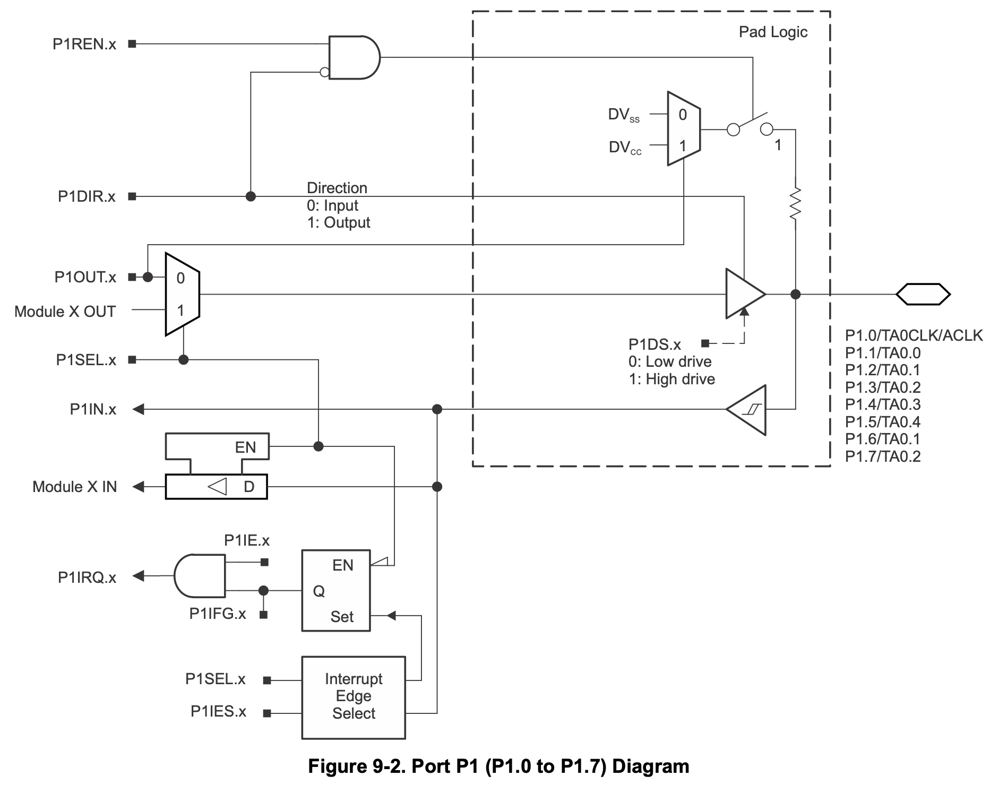

[⬅ Zurück zur Kapitelübersicht](../README.md#kapitelübersicht--aufgabenstellungen)

# Digitale Ein-/Ausgabe

## Inhalt

**Laborübung**

- *MSP430x5xx and MSP430x6xx Family User Guide Rev. O* – Texas Instruments
  - Kapitel 1.3: Interrupts
  - Kapitel 12: Digital I/O Module

**Wissensüberprüfung**

- Internet-Recherche: Was ist ein Interrupt in der Mikrocontroller-Technik?
- Kapitel 12.2.7: Port Interrupts im User Guide

---
### Durchzuführende Aufgaben
- [[AUFGABE] Rechendauer-Performance-Test](#durchzuführende-arbeit--dokumentation)
- [[AUFGABE] Recherche Allgemeine Interruptsteuerung](#recherche-durchzuführende-arbeit--dokumentation)
- [[AUFGABE] Implementierung Allgemeine Interruptsteuerung](#implementierung-durchzuführende-arbeit--dokumentation)
- [[AUFGABE] Debugging Übung](#aufgaben)

## Rechendauer-Performance-Test

Nach Abschluss der I/O-Port-Konfiguration soll die Rechendauer einer Integer- bzw. einer Fließkommaoperation überprüft werden.

### Durchzuführende Arbeit & Dokumentation

1. Führen Sie jeweils eine Fließkommazahl- und eine Integer-Berechnung durch.
2. Schalten Sie vor jeder Berechnung die Display-Hintergrundbeleuchtung ein und danach wieder aus.
3. Messen und dokumentieren Sie die Rechendauer mithilfe eines Oszilloskops.

---
<p align="center">
  
</p>

## Einführung in die Interrupt-Konfiguration (MSP430)

Bevor Interrupts verwendet werden können, müssen sie korrekt eingerichtet werden. Beim MSP430 umfasst dies mehrere Schritte:

### Schritte zur Konfiguration eines Port-Interrupts:

1. **Pinrichtung**: Der Pin muss als Eingang konfiguriert sein (PxDIR = 0).
2. **Interrupt-Enable-Register**: Aktivieren Sie den Interrupt für den gewünschten Pin (z. B. `P1IE |= BIT3;`).
3. **Interrupt Edge Select**: Wählen Sie steigende oder fallende Flanke (z. B. `P1IES &= ~BIT3;` für steigende Flanke).
4. **Interrupt-Flag-Register**: Das Flag wird durch das Ereignis gesetzt (z. B. `P1IFG & BIT3`). Es muss in der ISR gelöscht werden (`P1IFG &= ~BIT3;`).
5. **GIE (Global Interrupt Enable)**: Ermöglicht globale Interruptverarbeitung (`__enable_interrupt();`).
6. **ISR schreiben**: Für jeden Port gibt es eine zugehörige Interrupt-Service-Routine (z. B. `#pragma vector=PORT1_VECTOR`).

### Beispiel – Konfiguration des Port 1 Interrupts (P1.3)
```c
P1DIR &= ~BIT3;      // P1.3 als Eingang
P1REN |= BIT3;       // Pull-Up/Down aktivieren
P1OUT |= BIT3;       // Pull-Up auswählen
P1IE  |= BIT3;       // Interrupt aktivieren
P1IES &= ~BIT3;      // Steigende Flanke
P1IFG &= ~BIT3;      // Interrupt-Flag löschen
```
---

## Allgemeine I/O-Interruptsteuerung

Das Programm soll das Drücken der Start- bzw. Stopptaste per Interrupt erkennen, nicht per Polling.

### Recherche Durchzuführende Arbeit & Dokumentation

1. Erweitern Sie Ihre I/O-Port-Konfiguration, sodass Interrupts für Start- und Stopptaste aktiviert sind.
2. Stellen Sie die Flankenerkennung für die jeweiligen Pins ein.
3. Was ist Kontaktprellen und wie kann es schaltungs- oder softwaretechnisch verhindert werden?
4. Inwieweit beeinflusst ein Interrupt den zeitlichen Ablauf des Programms?
5. Was versteht man unter *Interrupt Nesting*?

---

## Interrupts

Wenn ein Interrupt ausgelöst wird, springt das Programm zur zugehörigen Interrupt Service Routine (ISR), deren Adresse im Interrupt-Vektor-Register gespeichert ist. Fehlt die ISR an dieser Stelle, sucht der Program Counter (PC) eine ungültige Adresse auf → Systemabsturz (z. B. ISR Fault Routine).

### Implementierung Durchzuführende Arbeit & Dokumentation

1. Schreiben Sie eine ISR für den Port-Vektor. Die korrekte ISR-Syntax entnehmen Sie einem Beispiel im *Resource Explorer*.
2. Aktivieren Sie das GIE-Bit am Ende der `HAL_GPIO_Init`-Funktion mit:
   ```c
   __enable_interrupt();
   ```
3. Welche Funktion hat das GIE-Bit?
4. Definieren Sie in `hal_gpio.h` eine Datenstruktur:
   ```c
   typedef struct {
       unsigned char active; // TRUE = 1 / FALSE = 0
       unsigned char button; // Button number
   } ButtonCom;
   ```
5. Deklarieren Sie eine globale Variable vom Typ `ButtonCom` in `hal_general.c`.
6. Deklarieren Sie dieselbe Variable in `main.c` und `hal_gpio.c` als `extern`.
7. Fragen Sie in der ISR ab, welche Taste gedrückt wurde (nur zwei Tasten vorhanden → Bitmask).
8. Setzen Sie in der ISR das `active`-Flag und die `button`-Nummer.
9. In der Endlosschleife von `main()` soll überprüft werden:
   - Wenn Starttaste gedrückt: Hintergrundbeleuchtung einschalten
   - Wenn Stopptaste gedrückt: Hintergrundbeleuchtung ausschalten
10. Welche Interrupt-Priorität besitzt der verwendete Port?

---

## Debugging-Übung

Debugging ist essentiell, um Fehler im Code zu finden und zu analysieren. Mit Breakpoints, Registeransicht und Expression-Watch lassen sich Probleme gezielt lokalisieren.

### Aufgaben:

1. Setzen Sie Breakpoints an folgenden Stellen:
   - `main.c`: Nach der Abfrage `CCbutton.active`
     - Beobachten Sie den Wert von `CCbutton.button`. Kann der Entscheidungsfluss im Debugger beeinflusst werden?
   - `hal_gpio.c`: Vor der `switch`-Anweisung in der ISR
     - Beobachten Sie das Register `P1IFG`. Wurde das korrekte Interrupt-Flag gesetzt?
   - `hal_general.c`: In der Funktion `HAL_Init`, vor und nach `HAL_GPIO_Init()`

2. Registeransicht öffnen
   - Überprüfen Sie live im Debugger die Register von `P1` und `P2`, speziell `P1IFG`.
   - Hinweis: Einige Register können im laufenden Betrieb nicht angezeigt oder verändert werden.

3. Expression-Watch nutzen:
   - Fügen Sie z. B. `CCbutton.active` zur Watch-Liste hinzu (Rechtsklick → "Add to Watch Expression").
   - Ändern Sie den Wert direkt und beobachten Sie die Auswirkung auf das Programm.

4. Bedingte Breakpoints:
   - In `hal_gpio.c`: Rechtsklick auf Breakpoint → "Breakpoint Properties"
   - Unter "Condition" eine Bedingung eingeben (z. B. `CCbutton.button == 1`), um nur bei gedrückter Starttaste zu stoppen.

[⬆ Zurück zum Hauptverzeichnis](../README.md#kapitelübersicht--aufgabenstellungen)
