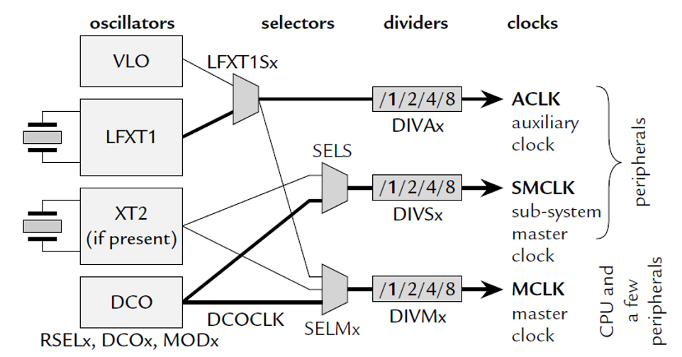

[⬅ Zurück zur Kapitelübersicht](../README.md#kapitelübersicht--aufgabenstellungen)
# Clock System, TimerB0 Konfiguration

## Inhalt
- [Taktquellen und Taktverteilung im MSP430](#taktquellen-und-taktverteilung-im-msp430)
- [Oszillatoren und Taktquellen](#oszillatoren-und-taktquellen)
- [Taktverteilung über Selektoren und Teiler](#taktverteilung-über-selektoren-und-teiler)
- [Power Management Module (PMM)](#power-management-module-pmm)
- [Unified Clock System (UCS)](#unified-clock-system-ucs)
- [Timer Interrupts – Timer B0](#timer-interrupts--timer-b0)
- [Blockierendes Warten](#blockierendes-warten)
- [Zusätzlich Fragen für die Meilensteinüberprüfung](#zusätzlich-fragen-für-die-meilensteinüberprüfung)

**Laborübung**

- *MSP430x5xx and MSP430x6xx Family User Guide Rev. O* – Texas Instruments
  - Kapitel 5: Unified Clock System [Family Guide - Unified Clock System](https://e2e.ti.com/cfs-file/__key/communityserver-discussions-components-files/166/MSP430x6-Family-User-Guide.pdf#page=158)
  - Kapitel 18: Timer B [Family Guide - Timer B](https://e2e.ti.com/cfs-file/__key/communityserver-discussions-components-files/166/MSP430x6-Family-User-Guide.pdf#page=484)
- Crazy Car Controller FHJ Schaltplan (Quarz, Clock) [Crazy Car Schematic](https://fhjoanneum-my.sharepoint.com/:b:/g/personal/florian_mayer_fh-joanneum_at/EfXYu-rqsLRErJbybsbN4AEB_RUMizJhwpb5D_ysimZehA?e=Ti7PtO)

**Wissensüberprüfung**

- Kapitel 5.1: [Unified Clock System (UCS) Introduction](https://e2e.ti.com/cfs-file/__key/communityserver-discussions-components-files/166/MSP430x6-Family-User-Guide.pdf#page=159)
  - Clock Sources
  - UCS Clock Signals
- Kapitel 18.1: [Timer B Introduction](https://e2e.ti.com/cfs-file/__key/communityserver-discussions-components-files/166/MSP430x6-Family-User-Guide.pdf#page=485)
  - Beschreibung
  - Timer-Bitbreite
  - Blockschaltbild
- Kapitel 18.2.3: [Timer B Mode Control](https://e2e.ti.com/cfs-file/__key/communityserver-discussions-components-files/166/MSP430x6-Family-User-Guide.pdf#page=488)
  - Table 18-1. Timer Modes
- Kapitel 18.2.3.1: [Up Mode](https://e2e.ti.com/cfs-file/__key/communityserver-discussions-components-files/166/MSP430x6-Family-User-Guide.pdf#page=488)
  - Zusammenhang: Eingangsfrequenz → Timer-Teiler (TBxCL0, TBxCCR0) → Ausgangsfrequenz

**!!Taschenrechner für Frequenzberechnung empfohlen!!**

**Video**
 - [Einführungsvideo - Einheit 3](https://youtu.be/PKbX4UOLLyc?si=cjtgWto6aFb2LdDT)

## Durchzuführende Aufgaben
- [[AUFGABE] Konfiguration des UCS](#aufgabe-konfiguration-des-ucs)
- [[AUFGABE] Konfiguration und Aufsetzen des TimerB0](#aufgabe-konfiguration-und-aufsetzen-des-timerb0)
- [[AUFGABE] Blockierendes Warten](#aufgabe-blockierendes-warten)
---

## Taktquellen und Taktverteilung im MSP430

Bevor der Unified Clock System (UCS) konfiguriert wird, ist es hilfreich, die grundlegende Struktur des Taktsystems des MSP430 zu verstehen. Die folgende Abbildung zeigt die drei zentralen Taktpfade:

<p align="center">
  
</p>

### Oszillatoren und Taktquellen
- **VLO**: Very Low Frequency Oscillator (typ. 10 kHz), stromsparend, geringe Genauigkeit
- **LFXT1**: Low-Frequency Crystal (z. B. 32.768 Hz Quarz)
- **XT2**: Optionaler Hochfrequenzquarz (z. B. 20 MHz)
- **DCO**: Digitally Controlled Oscillator – Haupttaktquelle für schnellen Systemtakt (bis 25 MHz)

### Taktverteilung über Selektoren und Teiler
Die Taktquellen können über Multiplexer (Selector) jeweils einem der drei Haupttakte zugewiesen werden. Jeder Takt kann zusätzlich durch einen Teiler reduziert werden:

- **ACLK** (Auxiliary Clock): für stromsparende Peripherien (z. B. RTC, Timer)
- **SMCLK** (Sub-Main Clock): für schnelle Peripherien (Timer, UART, etc.)
- **MCLK** (Main Clock): Systemtakt für die CPU

Die Register `SELAx`, `SELSx`, `SELMx` steuern die Zuweisung der Taktquellen, während `DIVAx`, `DIVSx`, `DIVMx` die Division der Frequenz konfigurieren.

### Beispiel
Wenn z. B. XT2 = 20 MHz ist und über `SELMx` dem MCLK zugewiesen wird, ergibt sich:

- MCLK = 20 MHz
- SMCLK = 2.5 MHz (XT2 mit Divider /8)
- ACLK = 32.768 Hz (aus REFO)

Diese Konfiguration bildet die Basis für Timer- und UART-Module, die auf eine präzise Taktrate angewiesen sind.

---

## Power Management Module (PMM)

Das PMM wird in dieser Laborübung nicht detailliert behandelt, eine Grundkonfiguration ist jedoch notwendig, um den MSP430 mit 20 MHz betreiben zu können. Binden Sie hierzu `halPMM.c` und die zugehörige Header-Datei gemäß [Anlegen eines Projektes](../Kapitel_01_Einfuehrung/README.md#projekt-erstellen) ein.

---

## Unified Clock System (UCS)

Um die Peripherie und Systemkomponenten im MSP430 korrekt zu betreiben, muss das Taktungssystem konfiguriert werden. Zwar ist initial eine Default-Konfiguration aktiv, für Hochfrequenzbetrieb (z. B. 20 MHz) sind jedoch explizite Schritte notwendig.
Ist ein Quarz angeschlossen, so muss dieser per Pinmux freigeschaltet und das UCS-Modul entsprechend parametriert werden. Achten Sie auf Frequenzvorgaben, Genauigkeit und Energieverbrauch bei der Auswahl der Taktquelle.

### [AUFGABE] Konfiguration des UCS

1. **Konfigurieren Sie die XT2-Pins** in `halGPIO.c`, sodass der Quarz korrekt mit dem UCS-Modul verbunden ist. *([siehe MSP430F5335 Datasheet, S. 92](https://www.ti.com/lit/ds/symlink/msp430f5335.pdf))*

2. **Neues HAL-Modul:** `halUCS.c/.h`
   - Implementieren Sie `halUCSInit()` und rufen Sie diese Funktion innerhalb von `halInit()` auf.

   **Hilfestellung:** Register laut [Family User Guide Kapitel 5](https://e2e.ti.com/cfs-file/__key/communityserver-discussions-components-files/166/MSP430x6-Family-User-Guide.pdf#page=159): `UCSCTLx`

   ```c
   void halUCSInit(void)
   {
       UCSCTL6 &= ~XT2OFF;             // XT2 einschalten
       UCSCTL3 |= SELREF_2;            // FLL Referenz = REFO
       UCSCTL4 |= SELA_2;              // ACLK = REFO

       // Warten bis Fehlerflags gelöscht sind
       while (SFRIFG1 & OFIFG)
       {
           UCSCTL7 &= ~(XT2OFFG + DCOFFG + XT1HFOFFG + XT1LFOFFG);
           SFRIFG1 &= ~OFIFG;
       }

       UCSCTL6 &= ~XT2DRIVE_3;         // Drive-Strength-Feld löschen
       UCSCTL6 |=  XT2DRIVE_2;         // und nach dem Anlauf reduziert setzen

       UCSCTL4 |= SELS__XT2CLK;        // SMCLK = XT2
       UCSCTL4 |= SELM__XT2CLK;        // MCLK  = XT2

       UCSCTL5 |= DIVS_3;              // SMCLK Divider /8
   }
   ```
   **Was passiert hier?** Der Oszillator XT2 wird aktiviert, Fehlerflags werden gelöscht, und die Systemtakte (MCLK, SMCLK) werden auf die Quarzquelle umgelegt. Der korrekte Betrieb wird durch Abfrage der Fault-Flags abgesichert.

3. **Taktkonfiguration**
   - MCLK = 20 MHz
   - SMCLK = 2.5 MHz (z. B. über Divider /8)
   - ACLK = beliebig (z. B. REFO = 32.768 Hz)

4. **Frequenzmessung:**
   - SMCLK an GPIO ausgeben und mit Oszilloskop messen. Dazu den jeweiligen Pin in `halGPIO.c` korrekt konfigurieren.

5. **Frequenzen im Header definieren:**
   ```c
   #define XTAL_FREQU   20000000
   #define MCLK_FREQU   20000000
   #define SMCLK_FREQU   2500000
   ```

   *(Optional: Prüfen Sie, ob sich durch Anpassen des SMCLK-Dividers verschiedene Timerfrequenzen effizient ableiten lassen.)*

---

## Timer Interrupts – Timer B0

Applikationen, die auf Mikrocontrollern ablaufen, erfordern meist ein genaues Timing. Dieses Timing bzw. zyklische Aufrufen von Funktionen, Routinen oder Triggern kann durch einen Timer realisiert werden. Diese Timer sind Teil der Peripherie des Mikrocontrollers und laufen in Hardware – verbrauchen somit keine CPU-Rechenzeit.

Der TimerB0 soll so konfiguriert werden, dass die Hintergrundbeleuchtung des Displays im 2 Hz-Takt blinkt. Verwenden Sie dazu das Capture/Compare-Register 0 (`TBCCR0`) und den `SMCLK` als Eingangstaktquelle.

**Hilfestellung:** [Family User Guide (Kapitel 18, Seite 482)](https://e2e.ti.com/cfs-file/__key/communityserver-discussions-components-files/166/MSP430x6-Family-User-Guide.pdf#page=482). Achten Sie auf die Konfiguration von: `TBxCTL`, `TBxCCTL0`, `TBxEX0`, `TBxCCR0`

Interrupt Vector: `TIMER0_B0_VECTOR` (für CCR0)

### [AUFGABE] Konfiguration und Aufsetzen des TimerB0

1. Erstellen Sie ein neues HAL-Modul `halTimerB0.c` und `halTimerB0.h`, und schreiben Sie eine Funktion `halTimerB0Init()`. Diese soll in der `halInit()` Funktion aufgerufen werden.

2. Konfigurieren Sie den Timer entsprechend der Vorgaben. Schalten Sie die Hintergrundbeleuchtung des Displays mittels Makros in der ISR des Timers ein bzw. aus. **Tipp:** Toggle I/O Pin.

3. Verwenden Sie für die Berechnung des Timer-Werts die im UCS-Modul definierten Werte. Definieren Sie auch die Ausgangsfrequenz des Timers mittels `#define`.
`TimerB0` soll so konfiguriert werden, dass die Hintergrundbeleuchtung des Displays im 2Hz Takt blinkt.

4. Fragen Sie in der ISR das richtige Interrupt-Flag des Timers ab.

5. Kontrollieren und dokumentieren Sie die Frequenz der Hintergrundbeleuchtung mit dem Oszilloskop.

6. [Meilensteinüberprüfung] Mit welcher Frequenz muss die ISR aufgerufen werden, damit das Licht mit 2 Hz blinkt? Begründen Sie.

---

## Blockierendes Warten

Zeit vergehen lassen geht auch ohne Timer: Man zählt einfach Taktzyklen ab.

```c
void delayMsBlocked(unsigned int ms)
{
    while(ms--)
    {
        __delay_cycles(MCLK_FREQU / 1000);   // 1 ms bei MCLK
    }
}
```

Die Funktion gehört ins UCS-Modul, weil sie die Taktfrequenz kennen muss – `__delay_cycles()` zählt Zyklen, keine Zeit. Ändert sich MCLK, stimmt die Wartezeit automatisch mit.

### [AUFGABE] Blockierendes Warten

1. Implementieren Sie `delayMsBlocked()` in `halUCS.c`, den Prototyp in `halUCS.h`.

2. Bauen Sie **zusätzlich** eine zweite Blinkvariante: Schalten Sie das Backlight in der Endlosschleife von `main()` um und warten Sie dazwischen mit `delayMsBlocked()`. Die Timer-Variante bleibt dafür vorübergehend deaktiviert.

3. Messen Sie beide Varianten am Oszilloskop und vergleichen Sie die Frequenzen.

4. Lassen Sie bei laufender Delay-Variante zusätzlich die Tasterauswertung aus Einheit 2 arbeiten. Drücken Sie mehrfach und beobachten Sie, wann das Programm reagiert.

### Zu dokumentieren

1. Wie genau trifft die Delay-Variante die geforderte Frequenz? Woher kommt die Abweichung?
2. Was tut die CPU während `delayMsBlocked()`?
3. Die ISR läuft auch während des Wartens an – warum reagiert das Programm trotzdem verzögert?
4. Welche der beiden Varianten lässt sich um weitere Aufgaben erweitern, ohne dass die Blinkfrequenz leidet?

> **Wann die Funktion trotzdem richtig ist:** Blockierendes Warten ist nicht grundsätzlich falsch, sondern nur meistens. Es passt dort, wo Schritte zwingend nacheinander ablaufen müssen und nichts Paralleles zu tun ist – etwa beim Hochfahren eines Layers, der nach einem Reset eine feste Zeit braucht, bevor er auf Befehle reagiert. Genau dafür setzen wir sie in späteren Einheiten ein. **In einer ISR hat sie dagegen NIE etwas zu suchen.**

---

### Zusätzliche Fragen für die Meilensteinüberprüfung

- Welche Vorteile bietet Timer-Hardware gegenüber softwarebasierter Zeitsteuerung?
- Wie viele unabhängige Timer besitzt der MSP430F5335, und wie unterscheiden sich TimerA und TimerB?
- Wie beeinflusst die Auswahl von SMCLK-Divider und TBxEX0-Divider die maximale Auflösung und Reichweite des Timers?
- Kann ein zweiter Timer für PWM-Erzeugung parallel verwendet werden, ohne den ersten zu beeinflussen?
---

Falls im späteren Verlauf PWM, ADC-Trigger oder Watchdog-Funktionalitäten benötigt werden, sollten die vorhandenen Timerkanäle effizient verwaltet werden.

## Testing

In dieser Einheit ergänzen Sie die bereitgestellte Testsuite zum ersten Mal um eigene Testfälle:

➡ **[Testing – Eigene Testfälle](Testing/Testing.md)**

## Referenzen

- **MSP430x5xx and MSP430x6xx Family User Guide**, Texas Instruments, Literature Number: SLAU208O, Rev. O, April 2019.  
  Verfügbar unter: [https://www.ti.com/lit/pdf/slau208](https://www.ti.com/lit/pdf/slau208)

- **MSP430F5335 Datasheet**, Texas Instruments, Document Number: SLAS590N, Rev. N, October 2018.  
  Verfügbar unter: [https://www.ti.com/lit/gpn/msp430f5335](https://www.ti.com/lit/gpn/msp430f5335)

- John H. Davies, **MSP430 Microcontroller Basics**, Newnes/Elsevier, ISBN 978‑0‑7506‑8276‑3.  

[⬆ Zurück zum Hauptverzeichnis](../README.md#kapitelübersicht--aufgabenstellungen)