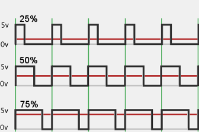
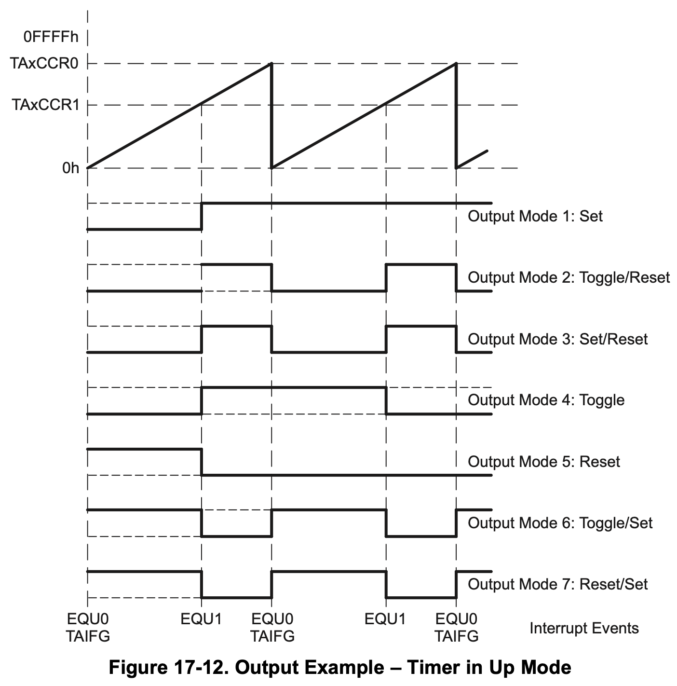
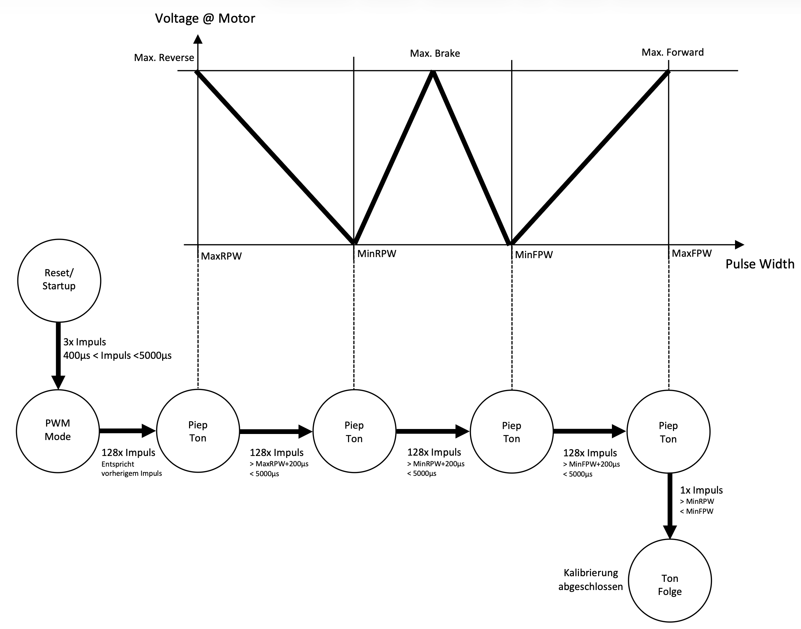

[⬅ Zurück zur Kapitelübersicht](../README.md#kapitelübersicht--aufgabenstellungen)
# PWM-Erzeugung, Aktorik

## Inhalt

**Laborübung**

- *MSP430x5xx and MSP430x6xx Family User Guide Rev. O* – Texas Instruments
  - Kapitel 17: [Timer A](https://e2e.ti.com/cfs-file/__key/communityserver-discussions-components-files/166/MSP430x6-Family-User-Guide.pdf#page=462)

- Crazy Car Controller FHJ Schaltplan [Crazy Car Schematic](https://fhjoanneum-my.sharepoint.com/:b:/g/personal/florian_mayer_fh-joanneum_at/EfXYu-rqsLRErJbybsbN4AEB_RUMizJhwpb5D_ysimZehA?e=Ti7PtO)

**Wissensüberprüfung**

- Recherche:
  - Was ist ein PWM-Signal?
  - Was ist der Duty Cycle?
  - Wie sieht das Standard-Servo-Signal im Modellbau aus?
- Family User Guide – Kapitel 17
  - 17.1: [Timer A Introduction](https://e2e.ti.com/cfs-file/__key/communityserver-discussions-components-files/166/MSP430x6-Family-User-Guide.pdf#page=463)
    - Beschreibung
    - Timer-Bitbreite
    - Blockschaltbild
  - 17.2.3.1: [Timer A Up Mode](https://e2e.ti.com/cfs-file/__key/communityserver-discussions-components-files/166/MSP430x6-Family-User-Guide.pdf#page=466)
    - Zusammenhang: Eingangsfrequenz → PWM-Auflösung
    - Zusammenhang: Timer-Teiler → PWM Duty Cycle/Pulsbreite
  - 17.2.4.2: [Compare Mode](https://e2e.ti.com/cfs-file/__key/communityserver-discussions-components-files/166/MSP430x6-Family-User-Guide.pdf#page=471)
  - 17.2.5.1: [Output Modes – Table 17-2](https://e2e.ti.com/cfs-file/__key/communityserver-discussions-components-files/166/MSP430x6-Family-User-Guide.pdf#page=471)
  - 17.2.5.1.1: [Output Example](https://e2e.ti.com/cfs-file/__key/communityserver-discussions-components-files/166/MSP430x6-Family-User-Guide.pdf#page=471)
---
**Video**
 - [Einführungsvideo - Einheit 4](https://youtu.be/OJhuOfwQRsg?si=YxCrUnW_ZD87oew3)

### Durchzuführende Aufgaben
- [[AUFGABE] TimerA Erzeugung der PWM](#aufgabe-durchzuführende-arbeit--dokumentation-für-die-meilensteinüberprüfung)
- [[AUFGABE] DriverLayer, Steering & Throttle](#aufgabe-durchzuführende-arbeit--dokumentation-für-die-meilensteinüberprüfung-1)
- [[AUFGABE] Drehzahlmessung](#aufgabe-drehzahlmessung-komplett-eigenständig)

## Grundlagen: PWM beim MSP430

  

Die Pulsweitenmodulation (PWM) ist eine Technik zur Erzeugung eines periodischen digitalen Signals, bei dem das Verhältnis von High- zu Low-Zeit innerhalb einer Periode – der sogenannte **Duty Cycle** – variiert wird. Beim MSP430 wird PWM typischerweise über die Hardwaretimer (Timer A oder B) realisiert, wobei folgende Prinzipien gelten:

- Der Timer zählt von 0 bis zu einem festgelegten Maximalwert (z. B. in `TAxCCR0`).
- Ein Vergleichswert (z. B. `TAxCCR1`) bestimmt den Umschaltpunkt zwischen High und Low innerhalb der Periode.
- Der Vergleich erfolgt hardwareseitig und benötigt keine CPU-Zeit (stromsparend und präzise).

Ein PWM-Signal mit konstanter Periode (z. B. 16.67 ms für 60 Hz) und variabler Pulsbreite (z. B. 1–2 ms) eignet sich ideal zur Ansteuerung von Servos oder Motoren.

### Was ist ein PWM-Signal?
Ein PWM-Signal ist ein digitales Rechtecksignal, bei dem innerhalb eines festen Zeitintervalls (z. B. 16.67 ms) die Länge des High-Pegels variiert werden kann. Die Schaltfrequenz bleibt gleich, nur das Tastverhältnis (Duty Cycle) ändert sich.

### Was ist der Duty Cycle?
Der Duty Cycle beschreibt das Verhältnis der Einschaltdauer zur gesamten Periodendauer eines PWM-Signals und wird in Prozent angegeben:

$$\text{Duty Cycle} = \frac{t_{\text{on}}}{t_{\text{per}}} \cdot 100\% $$

Beispiel: Bei einer Periode von 20 ms und einem High-Signal von 1.5 ms ergibt sich ein Duty Cycle von 7.5 %.

### Standard-Servo-Signal im Modellbau
Modellbau-Servos erwarten typischerweise ein PWM-Signal mit einer Frequenz von 50–60 Hz. Die Steuerung erfolgt durch die Pulsbreite:

- 1.0 ms → maximale Auslenkung in eine Richtung
- 1.5 ms → Mittelstellung
- 2.0 ms → maximale Auslenkung in die andere Richtung

Die restliche Zeit innerhalb der 20 ms Periode ist das Signal Low. Die Genauigkeit der Ansteuerung hängt von der Auflösung des Timers ab.

---

## Timer A1 – PWM-Erzeugung

Ein PWM-Signal (Pulsweitenmodulation) soll mittels Timer A1 erzeugt werden, um das Lenkservo und den Fahrtenregler (ESC) anzusteuern. Die PWM-Frequenz soll 60 Hz betragen. Die Pulsbreite (ca. 1 ms bis 2 ms) steuert die Position des Servos bzw. die Motordrehzahl.

**Achtung:** Das Servo darf sich mechanisch nicht überdrehen!

**Faustregel:**
- 1 ms ≈ ganz links/rechts
- 1.5 ms ≈ Mitte
- 2 ms ≈ ganz rechts/links

### [AUFGABE] Durchzuführende Arbeit & Dokumentation für die Meilensteinüberprüfung

1. Erstellen Sie das HAL-Modul `hal_timerA1.c/.h` mit der Funktion `hal_TimerA1Init()`. Diese wird in `hal_Init()` eingebunden.

2. Konfigurieren Sie den Timer für **2 PWM-Kanäle**, 60 Hz:
   - Wählen Sie eine passende Eingangstaktfrequenz, sodass die PWM-Pulsbreite (z. B. 1.0–2.0 ms) eine feine Auflösung (z. B. 100 Schritte) erlaubt.
   - Wählen Sie den richtigen `OUTMOD` im zugehörigen `TAxCCTLn`. (vgl. Family Guide Kapitel 17)

3. Startbedingung: Nach `hal_Init()` soll **kein Puls erzeugt werden** (d. h. Duty Cycle = 0 %). Die Initialisierung des PWM-Werts erfolgt später in `DL_Init()`.

4. Konfigurieren Sie die verwendeten GPIO-Pins für PWM-Ausgabe (Port-Funktion freischalten, Pin-Direction setzen).

> **Hinweis:** Beachten Sie die korrekte Beschaltung der Ausgänge!

  

### Servo anschließen

5. Schließen Sie das Servo am Crazy Car Controller an. Die Versorgung erfolgt über den ESC. Akku anschließen, ESC einschalten.

**Wichtig:** Fahrzeug muss sicher aufgebockt sein – bei Fehlkonfiguration kann es zu plötzlichen Bewegungen kommen!

6. Ermitteln Sie per Debugger die Registerwerte für:
   - Mittelstellung
   - Max. Links
   - Max. Rechts

7. Speichern Sie diese Werte als `#define` im Headerfile ab (z. B. `#define SERVO_CENTER 1500`).

---

## Driver Layer – Aktorik

Für die Abstraktion der Hardwarezugriffe wird ein Driver Layer (DL) eingeführt. Dieser Layer definiert eine Softwareschnittstelle zur Aktorik, die in der Applikation verwendet werden kann und **nicht** mehr geändert werden soll.

### [AUFGABE] Durchzuführende Arbeit & Dokumentation für die Meilensteinüberprüfung

1. Legen Sie einen neuen Ordner `DL` im Projekt an.

2. Erstellen Sie `dl_General.c/.h`:
   - Funktion `dl_Init(void)` programmieren, die alle DL-Module initialisiert (vgl. Basisprojekt).

3. Erstellen Sie `dl_Aktorik.c/.h`

4. Programmieren Sie:
   - `dl_SetSteering(int8_t iValue)` → z. B. Bereich -100 (links) bis +100 (rechts), 0 = Mitte
   - Die Funktion soll den Eingabewert auf die PWM-Registerwerte umrechnen und setzen

5. Programmieren Sie `dl_SteeringInit()` → Setzt das Servo auf Mittelstellung. Diese wird innerhalb von `dl_Init()` aufgerufen.

  

6. Programmieren Sie `dl_SetThrottle(int8_t iValue)`
   - Umrechnung wie bei `SetSteering`
   - PWM-Registerwerte innerhalb spezifizierter Pulsbreiten setzen

7. Programmieren Sie `dl_ThrottleInit()` bzw. `dl_ESCInit()`
   - Initialisierung nach Setup-Vorgabe
   - Wartezeiten via CCR0-Interrupt oder `__delay_cycles()`
   - Aufruf in `dl_Init()`

---

## [AUFGABE] Drehzahlmessung (Komplett Eigenständig)

Die Drehzahlmessung erfolgt mittels Capture-Funktion des Timers.

## Referenzen

- **MSP430x5xx and MSP430x6xx Family User Guide**, Texas Instruments, Literature Number: SLAU208O, Rev. O, April 2019.  
  Verfügbar unter: [https://www.ti.com/lit/pdf/slau208](https://www.ti.com/lit/pdf/slau208)

- **MSP430F5335 Datasheet**, Texas Instruments, Document Number: SLAS590N, Rev. N, October 2018.  
  Verfügbar unter: [https://www.ti.com/lit/gpn/msp430f5335](https://www.ti.com/lit/gpn/msp430f5335)

- John H. Davies, **MSP430 Microcontroller Basics**, Newnes/Elsevier, ISBN 978‑0‑7506‑8276‑3.  

[⬆ Zurück zum Hauptverzeichnis](../README.md#kapitelübersicht--aufgabenstellungen)
