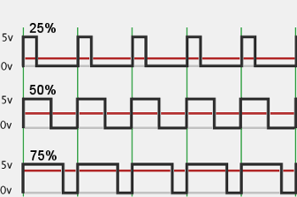
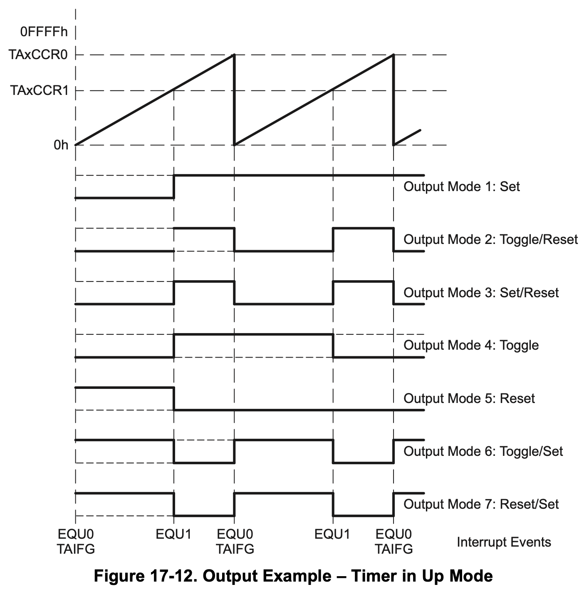
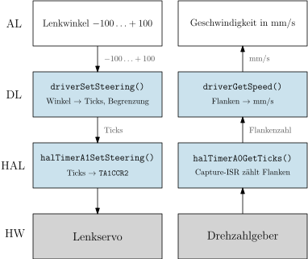
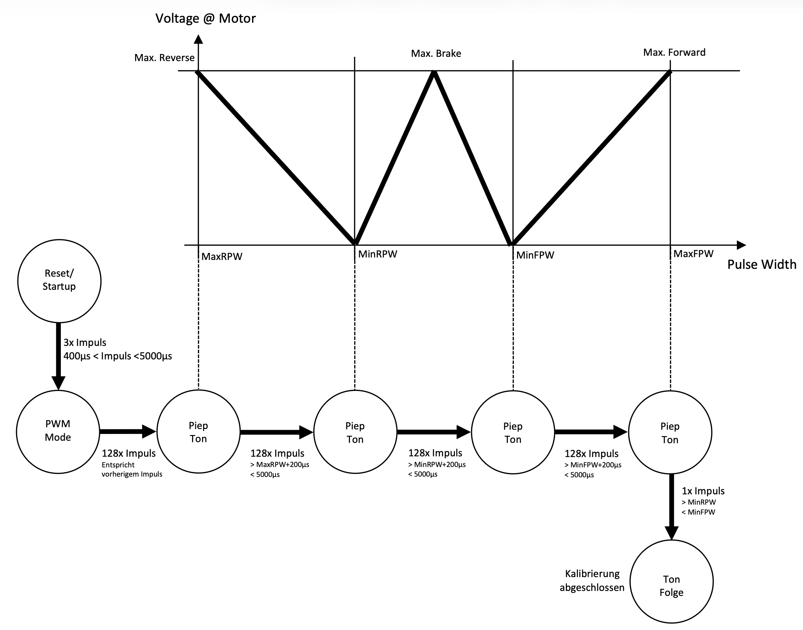

[⬅ Zurück zur Kapitelübersicht](../README.md#kapitelübersicht--aufgabenstellungen)
# PWM-Erzeugung, Aktorik

## Inhalt
  - [Grundlagen: PWM beim MSP430](#grundlagen-pwm-beim-msp430)
  - [Was ist ein PWM-Signal?](#was-ist-ein-pwm-signal)
  - [Was ist der Duty Cycle?](#was-ist-der-duty-cycle)
  - [Standard-Servo-Signal im Modellbau](#standard-servo-signal-im-modellbau)
  - [Timer A1, PWM-Erzeugung](#timer-a1-pwm-erzeugung)
  - [Driver Layer, Aktorik](#driver-layer-aktorik)
  - [Drehzahlmessung](#drehzahlmessung)

**Laborübung**

- *MSP430x5xx and MSP430x6xx Family User Guide Rev. O* – Texas Instruments
  - Kapitel 17: [Timer A](https://e2e.ti.com/cfs-file/__key/communityserver-discussions-components-files/166/MSP430x6-Family-User-Guide.pdf#page=462)

- Crazy Car Controller FHJ Schaltplan [Crazy Car Schematic](https://fhjoanneum-my.sharepoint.com/:b:/g/personal/florian_mayer_fh-joanneum_at/EfXYu-rqsLRErJbybsbN4AEB_RUMizJhwpb5D_ysimZehA?e=Ti7PtO)

**Wissensüberprüfung**

- Recherche:
  - Was ist ein PWM-Signal?
  - Was ist der Duty Cycle?
  - Wie sieht das Standard-Servo-Signal im Modellbau aus?
- Family User Guide – Kapitel 17
  - 17.1: [Timer A Introduction](https://e2e.ti.com/cfs-file/__key/communityserver-discussions-components-files/166/MSP430x6-Family-User-Guide.pdf#page=463)
    - Beschreibung
    - Timer-Bitbreite
    - Blockschaltbild
  - 17.2.3.1: [Timer A Up Mode](https://e2e.ti.com/cfs-file/__key/communityserver-discussions-components-files/166/MSP430x6-Family-User-Guide.pdf#page=466)
    - Zusammenhang: Eingangsfrequenz → PWM-Auflösung
    - Zusammenhang: Timer-Teiler → PWM Duty Cycle/Pulsbreite
  - 17.2.4.1: [Capture Mode](https://e2e.ti.com/cfs-file/__key/communityserver-discussions-components-files/166/MSP430x6-Family-User-Guide.pdf#page=471)
  - 17.2.4.2: [Compare Mode](https://e2e.ti.com/cfs-file/__key/communityserver-discussions-components-files/166/MSP430x6-Family-User-Guide.pdf#page=471)
  - 17.2.5.1: [Output Modes – Table 17-2](https://e2e.ti.com/cfs-file/__key/communityserver-discussions-components-files/166/MSP430x6-Family-User-Guide.pdf#page=471)
  - 17.2.5.1.1: [Output Example](https://e2e.ti.com/cfs-file/__key/communityserver-discussions-components-files/166/MSP430x6-Family-User-Guide.pdf#page=471)
---
**Video**
 - [Einführungsvideo - Einheit 4](https://youtu.be/OJhuOfwQRsg?si=YxCrUnW_ZD87oew3)

### Durchzuführende Aufgaben
- [[AUFGABE] TimerA1, Erzeugung der PWM](#aufgabe-timera1-erzeugung-der-pwm)
- [[AUFGABE] Servo anschließen](#aufgabe-servo-anschließen)
- [[AUFGABE] Driver Layer, Steering & Throttle](#aufgabe-driver-layer-steering--throttle)
- [[AUFGABE] Drehzahlmessung](#aufgabe-drehzahlmessung)

## Grundlagen: PWM beim MSP430

  

Die Pulsweitenmodulation (PWM) ist eine Technik zur Erzeugung eines periodischen digitalen Signals, bei dem das Verhältnis von High- zu Low-Zeit innerhalb einer Periode – der sogenannte **Duty Cycle** – variiert wird. Beim MSP430 wird PWM typischerweise über die Hardwaretimer (Timer A oder B) realisiert, wobei folgende Prinzipien gelten:

- Der Timer zählt von 0 bis zu einem festgelegten Maximalwert (z. B. in `TAxCCR0`).
- Ein Vergleichswert (z. B. `TAxCCR1`) bestimmt den Umschaltpunkt zwischen High und Low innerhalb der Periode.
- Der Vergleich erfolgt hardwareseitig und benötigt keine CPU-Zeit (stromsparend und präzise).

Ein PWM-Signal mit konstanter Periode (z. B. 16.67 ms für 60 Hz) und variabler Pulsbreite eignet sich ideal zur Ansteuerung von Servos oder Motoren.

### Was ist ein PWM-Signal?
Ein PWM-Signal ist ein digitales Rechtecksignal, bei dem innerhalb eines festen Zeitintervalls (z. B. 16.67 ms) die Länge des High-Pegels variiert werden kann. Die Schaltfrequenz bleibt gleich, nur das Tastverhältnis (Duty Cycle) ändert sich.

### Was ist der Duty Cycle?
Der Duty Cycle beschreibt das Verhältnis der Einschaltdauer zur gesamten Periodendauer eines PWM-Signals und wird in Prozent angegeben:

$$\text{Duty Cycle} = \frac{t_{\text{on}}}{t_{\text{per}}} \cdot 100\% $$

Beispiel: Bei einer Periode von 20 ms und einem High-Signal von 1.5 ms ergibt sich ein Duty Cycle von 7.5 %.

### Standard-Servo-Signal im Modellbau
Modellbau-Servos erwarten typischerweise ein PWM-Signal mit einer Frequenz von 50–60 Hz. Die Steuerung erfolgt durch die Pulsbreite:

- 1.0 ms → maximale Auslenkung in eine Richtung
- 1.5 ms → Mittelstellung
- 2.0 ms → maximale Auslenkung in die andere Richtung

Die restliche Zeit innerhalb der 20 ms Periode ist das Signal Low. Die Genauigkeit der Ansteuerung hängt von der Auflösung des Timers ab.

---

## Timer A1, PWM-Erzeugung

Ein PWM-Signal (Pulsweitenmodulation) soll mittels Timer A1 erzeugt werden, um das Lenkservo und den Fahrtenregler (ESC) anzusteuern. Die PWM-Frequenz soll 60 Hz betragen.

Beide Abnehmer hängen am selben Timer, werden aber unterschiedlich angesteuert:

- Das **Lenkservo** folgt der Pulsbreite direkt: Die Pulsbreite entspricht einer Position.
- Der **Fahrtenregler** ist kein Servo. Er benötigt beim Einschalten eine eigene Inbetriebnahmesequenz und reagiert erst danach auf Fahrbefehle. Die Vorgaben dazu finden Sie in der Präsentation.

**Achtung:** Das Servo darf sich mechanisch nicht überdrehen!

**Faustregel für das Servo:**
- 1 ms ≈ ganz links/rechts
- 1.5 ms ≈ Mitte
- 2 ms ≈ ganz rechts/links

### [AUFGABE] TimerA1, Erzeugung der PWM

Das Vorgehen kennen Sie von TimerB0 aus Einheit 3. Timer A1 wird nach derselben Systematik konfiguriert, mit zwei Unterschieden: Es werden zwei Vergleichskanäle statt einem benötigt, und die Kanäle schalten einen Ausgangspin, statt nur einen Interrupt auszulösen.

1. Erstellen Sie das HAL-Modul `halTimerA1.c/.h` mit der Funktion `halTimerA1Init()`. Diese wird in `halInit()` eingebunden.

2. Konfigurieren Sie den Timer nach folgender Liste. Die Berechnung der Werte entnehmen Sie der Präsentation, die Makros dem Family Guide, Kapitel 17.

   | Register | Einzustellen | Zweck |
   |---|---|---|
   | `TA1CTL` | Taktquelle | SMCLK als Eingangstakt |
   | `TA1CTL` | Teiler | falls erforderlich |
   | `TA1CCR0` | Periodenwert | soll passende Periodendauer beide Servos ergeben |
   | `TA1CCTL0` | Interrupt-Freigabe | Periodenzähler für die ESC-Sequenz |
   | `TA1CCTL1` | Ausgangsmodus | Kanal Gas |
   | `TA1CCR1` | Startwert | kein Puls nach der Initialisierung |
   | `TA1CCTL2` | Ausgangsmodus | Kanal Lenkung |
   | `TA1CCR2` | Startwert | kein Puls nach der Initialisierung |
   | `TA1CTL` | Zähler löschen, dann starten | Reihenfolge beachten |

3. Schreiben Sie je eine Funktion, die die Pulsbreite eines Kanals setzt: `halTimerA1SetSteering()` und `halTimerA1SetThrottle()`.

   Technisch könnte der Driver Layer `TA1CCR2` auch direkt beschreiben – eine Zeile statt eines Funktionsaufrufs. Dagegen sprechen drei Dinge:

   - **Nur eine Stelle kennt die Hardware.** Wird der Lenkkanal später auf einen anderen Timer oder Pin gelegt, ändert sich genau eine Funktion. Greift der DL selbst auf Register zu, muss jede dieser Stellen gesucht werden.
   - **Der Name sagt, was passiert.** `halTimerA1SetSteering(2750)` ist lesbar, `TA1CCR2 = 2750` verlangt, dass man die Pinbelegung im Kopf hat.
   - **Die Schnittstelle ist prüfbar.** Der Driver Layer lässt sich gegen eine definierte Funktion testen, nicht gegen ein Register, das jede andere Stelle im Programm ebenfalls beschreiben könnte.

   Diese Trennung ist die eigentliche Aufgabe der HAL: Sie ist die einzige Schicht, in der Registernamen vorkommen dürfen. Die Funktionen nehmen die Pulsbreite in Timer-Ticks entgegen – die Umrechnung von einem Lenkwinkel in Ticks ist Aufgabe des Driver Layers, die HAL kennt nur Register und Takt.

4. Startbedingung: Nach `halInit()` soll **kein Puls erzeugt werden** (d. h. Duty Cycle = 0 %). Die Initialisierung des PWM-Werts erfolgt später in `driverInit()`.

5. Konfigurieren Sie die verwendeten GPIO-Pins für PWM-Ausgabe (Port-Funktion freischalten, Pin-Direction setzen).

6. [Meilensteinüberprüfung] Welcher Ausgangsmodus erzeugt den gewünschten Puls, und warum bedeutet ein Vergleichswert von 0 damit „kein Puls"?

> **Hinweis:** Beachten Sie die korrekte Beschaltung der Ausgänge!

  

### [AUFGABE] Servo anschließen

1. Schließen Sie das Servo am Crazy Car Controller an. Die Versorgung erfolgt über den ESC. Akku anschließen, ESC einschalten. (Schalter am Heck des Fahrzeuges)

**Wichtig:** Fahrzeug muss sicher aufgebockt sein – bei Fehlkonfiguration kann es zu plötzlichen Bewegungen kommen!

2. Ermitteln Sie per Debugger die Registerwerte für:
   - Mittelstellung
   - Max. Links
   - Max. Rechts

   Ermitteln Sie die Position und Registerwerte, indem Sie im Debugger die Werte der einzelnen PWM-Kanal-Register ändern. Nähern Sie sich den Endanschlägen von innen an.

3. Speichern Sie diese Werte als `#define` im Headerfile ab (z. B. `#define ST_MIDDLE 3750`).

4. Messen und dokumentieren Sie das Signal am Lenkungs-Pin mit dem Analog Discovery: Frequenz und Pulsbreite für Mittelstellung und beide Endanschläge.

---

## Driver Layer, Aktorik

Für die Abstraktion der Hardwarezugriffe wird ein Driver Layer (DL) eingeführt. Dieser Layer definiert eine Softwareschnittstelle zur Aktorik, die in der Applikation verwendet werden kann und **nicht** mehr geändert werden soll.

  

### [AUFGABE] Driver Layer, Steering & Throttle

1. Legen Sie einen neuen Ordner `DL` im Projekt an. (Wenn nicht schon bereits gemacht)

2. Erstellen Sie `driverGeneral.c/.h`:
   - Funktion `driverInit(void)` programmieren, die alle DL-Module initialisiert (vgl. Basisprojekt). Aufruf in `main()` nach `halInit()`.

3. Erstellen Sie ein neues Modul `driverAktorik.c/.h`

4. Programmieren Sie:
   - `driverSetSteering(signed char steerVal)` → z. B. Bereich -100 (links) bis +100 (rechts), 0 = Mitte
   - Als Übergabeparameter soll ein Wertebereich gewählt werden, der einfacher verwendbar, lesbar und unabhängig von den daraus resultierenden Registerwerten ist.
   - Die Funktion soll den Eingabewert auf die PWM-Registerwerte umrechnen, auf die Endanschläge begrenzen und setzen

5. Programmieren Sie `driverSteeringInit()` → Setzt das Servo auf Mittelstellung. (Es darf aber auch `driverSetSteering(0)` logischerweise verwendet werden) Diese wird innerhalb von `driverInit()` aufgerufen.

  

6. Programmieren Sie `driverSetThrottle(signed char throttleVal)`
   - Umrechnung wie bei `driverSetSteering`
   - PWM-Registerwerte innerhalb spezifizierter Pulsbreiten setzen

7. Programmieren Sie `driverESCinit()`
   - Initialisierung nach Setup-Vorgabe aus der Präsentation
   - Wartezeiten via CCR0-Interrupt ermitteln (gewünschte Lösung) oder `delayMsBlocked()` (CPU-belastende Alternative)
   - Aufruf in `driverInit()`, erst wenn die Lenkung nachweislich funktioniert und das Fahrzeug aufgebockt ist

8. [Meilensteinüberprüfung] Warum greift `driverSetSteering()` nicht direkt auf das PWM-Register zu, obwohl das kürzer wäre?

---

## Drehzahlmessung

Am Getriebeausgang sitzt ein Geber, der pro Umdrehung mehrere Flanken liefert (`RPM_SENSOR`). Im **Capture Mode** reagiert der Timer selbstständig auf diese Flanken – die CPU zählt nur noch mit.

Verwendet wird **Timer A0**, getrennt vom PWM-Timer:

| Kanal | Aufgabe |
|---|---|
| `TA0CCR2` | Capture auf beide Flanken des Drehzahlgebers, zählt Flanken |
| `TA0CCR0` | fester Takt, schließt jeweils ein Messfenster ab |

Statt einzelne Flankenabstände auszuwerten, wird gezählt, **wie viele Flanken pro Zeitfenster** eintreffen. Je Flanke legt das Fahrzeug eine bekannte Strecke zurück.

### Tipps

- **Beide Flanken** zählen, sonst halbiert sich die Auflösung.
- **`SCS` setzen** – synchronisiert die Capture-Quelle auf den Timertakt.
- **Zwei Variablen:** Die Geber-ISR zählt hoch, die Fenster-ISR sichert den Wert und setzt
  zurück. Direkt auf dem laufenden Zähler zu rechnen liefert Werte, die sich beim Lesen
  ändern.
- **`volatile`** für alles, was eine ISR schreibt und der DL liest.
- **Wertebereich prüfen:** Bei der Umrechnung in mm/s wird multipliziert. Passt das
  Ergebnis bei voller Fahrt noch in einen 16-Bit-Wert?

### [AUFGABE] Drehzahlmessung

1. Erstellen Sie das HAL-Modul `halTimerA0.c/.h` mit `halTimerA0Init()`, Aufruf in `halInit()`.

2. Konfigurieren Sie `TA0CCR2` im Capture Mode auf beide Flanken und zählen Sie die Flanken in der zugehörigen ISR.

3. Konfigurieren Sie `TA0CCR0` als Messfenster. Sichern Sie am Fensterende den Zählerstand und setzen Sie den Zähler zurück.

4. Erstellen Sie `driverSensors.c/.h` und rechnen Sie die Flankenzahl in Geschwindigkeit (mm/s) und zurückgelegten Weg (mm) um. Den Weg pro Flanke legen Sie als `#define` ab.

5. Verifikation: Drehen Sie ein Rad von Hand eine definierte Anzahl Umdrehungen und vergleichen Sie den berechneten Weg mit dem Radumfang.

6. [Meilensteinüberprüfung] Warum wird über ein Zeitfenster gezählt und nicht der Abstand zweier Flanken gemessen? Was passiert bei sehr niedriger Drehzahl?

## Referenzen

- **MSP430x5xx and MSP430x6xx Family User Guide**, Texas Instruments, Literature Number: SLAU208O, Rev. O, April 2019.  
  Verfügbar unter: [https://www.ti.com/lit/pdf/slau208](https://www.ti.com/lit/pdf/slau208)

- **MSP430F5335 Datasheet**, Texas Instruments, Document Number: SLAS590N, Rev. N, October 2018.  
  Verfügbar unter: [https://www.ti.com/lit/gpn/msp430f5335](https://www.ti.com/lit/gpn/msp430f5335)

- John H. Davies, **MSP430 Microcontroller Basics**, Newnes/Elsevier, ISBN 978‑0‑7506‑8276‑3.  

[⬆ Zurück zum Hauptverzeichnis](../README.md#kapitelübersicht--aufgabenstellungen)