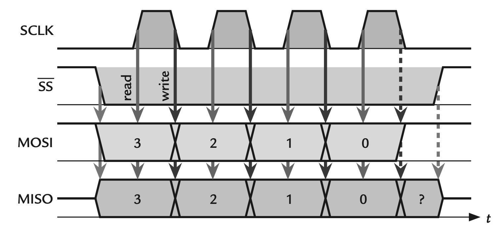

[⬅ Zurück zur Kapitelübersicht](../README.md#kapitelübersicht--aufgabenstellungen)

# SPI

## Inhalt
- [SPI – Inhalt](#spi)
- [SPI-Kommunikation – Grundlagen](#spi-kommunikation-grundlagen)
  - [Leitungen im SPI-Bus](#leitungen-im-spi-bus)
  - [Taktphasen und Polarität (CPOL, CPHA)](#taktphasen-und-polarität-cpol-cpha) 
  - [SPI-Datenübertragung – Shift Register](#spi-datenübertragung-shift-register)
  - [Datenfluss beim MSP430](#datenfluss-beim-msp430-register-und-schieberegister-logik)
- [USCI B1 – Konfiguration](#usci-b1konfiguration)
- [USCI A0 – UART-Konfiguration (optional)](#uart-konfiguration-optional)

**Laborübung**

- *MSP430x5xx and MSP430x6xx Family User Guide Rev. O* – Texas Instruments
  - Kapitel 37: [USCI – SPI Mode](https://e2e.ti.com/cfs-file/__key/communityserver-discussions-components-files/166/MSP430x6-Family-User-Guide.pdf#page=968) SPI: Signale, Aufbau und Funktionsweise

- Crazy Car Controller FHJ Schaltplan [Crazy Car Schematic](https://fhjoanneum-my.sharepoint.com/:b:/g/personal/florian_mayer_fh-joanneum_at/EfXYu-rqsLRErJbybsbN4AEB_RUMizJhwpb5D_ysimZehA?e=Ti7PtO)

**Wissensüberprüfung**

- Recherche:
  - SPI: Signal, Beschreibung und Funktionsweise, schematischer Busaufbau (als Skizze)
- MSP430x5xx and MSP430x6xx Family User Guide Rev. O – Texas Instruments
  - Kapitel 37.1: [USCI Overview](https://e2e.ti.com/cfs-file/__key/communityserver-discussions-components-files/166/MSP430x6-Family-User-Guide.pdf#page=969)
  - Kapitel 37.2: [USCI Introduction – SPI Mode + Block Diagram](https://e2e.ti.com/cfs-file/__key/communityserver-discussions-components-files/166/MSP430x6-Family-User-Guide.pdf#page=970)
  - Kapitel 37.3: USCI Operation Mode – Signalbeschreibungen ohne UCxSTE](https://e2e.ti.com/cfs-file/__key/communityserver-discussions-components-files/166/MSP430x6-Family-User-Guide.pdf#page=972)
  - Kapitel 37.3.3: [Master Mode](https://e2e.ti.com/cfs-file/__key/communityserver-discussions-components-files/166/MSP430x6-Family-User-Guide.pdf#page=973)
  - Kapitel 37.5.7: [UCBxRXBUF – Registerbeschreibung](https://e2e.ti.com/cfs-file/__key/communityserver-discussions-components-files/166/MSP430x6-Family-User-Guide.pdf#page=991)
  - Kapitel 37.5.8: [UCBxTXBUF – Registerbeschreibung](https://e2e.ti.com/cfs-file/__key/communityserver-discussions-components-files/166/MSP430x6-Family-User-Guide.pdf#page=991)

> **VORSICHT:** Die Aufschrift MOSI und CLK am Displayboard sind vertauscht.

**Video**
 - [Einführungsvideo - Einheit 5](https://youtu.be/q_kA9L3taqE?si=FuuGbJwFVF0v3IEW)

### Durchzuführende Aufgaben
- [[AUFGABE] USCI B1 – Konfiguration](#aufgabe-durchzuführende-arbeit--dokumentation-für-die-überprüfung-der-meilensteine)

---

## SPI-Kommunikation Grundlagen

SPI (Serial Peripheral Interface) ist ein synchrones serielles Kommunikationsprotokoll, das für den schnellen Datenaustausch zwischen einem Master (z. B. Mikrocontroller) und einem oder mehreren Slave-Geräten (z. B. Sensoren, Displays, Speicherbausteinen) verwendet wird. Die Kommunikation erfolgt über ein fest definiertes Leitungsschema und basiert auf einem gemeinsamen Takt.

### Leitungen im SPI-Bus

Der SPI-Bus verwendet typischerweise vier dedizierte Signalleitungen:

- **MOSI (Master Out, Slave In)** – Datenleitung vom Master zum Slave
- **MISO (Master In, Slave Out)** – Datenleitung vom Slave zum Master
- **SCLK (Serial Clock)** – vom Master erzeugter Takt
- **CS/SS (Chip Select / Slave Select)** – Auswahl des gewünschten Slave-Geräts (aktiv LOW)
<p align="center">
  
</p>

- Der **Master** steuert den Takt (SCLK) und kontrolliert über **CS/SS** die Aktivierung eines Slaves.
- Daten werden gleichzeitig (synchron) über MOSI und MISO übertragen: Bei jedem Taktimpuls wird ein Bit gleichzeitig gesendet und empfangen.
- SPI ist **vollduplexfähig**, d. h., Senden und Empfangen erfolgen simultan.

> **Hinweis:** Der SPI-Bus erlaubt auch die Anbindung mehrerer Slaves – dann benötigt jedes Slave-Gerät eine eigene CS-Leitung vom Master.

---

### Taktphasen und Polarität (CPOL, CPHA)

Das SPI-Protokoll definiert vier mögliche Modi, abhängig von zwei Parametern:

- **CPOL (Clock Polarity)**:
  - `CPOL = 0`: Takt ruht im LOW-Zustand
  - `CPOL = 1`: Takt ruht im HIGH-Zustand

- **CPHA (Clock Phase)**:
  - `CPHA = 0`: Daten werden an der ersten Flanke (erste Taktkante) übernommen
  - `CPHA = 1`: Daten werden an der zweiten Flanke (zweite Taktkante) übernommen

Die Kombination aus CPOL und CPHA ergibt vier SPI-Modi:

| SPI-Modus | CPOL | CPHA | Beschreibung                             |
|-----------|------|------|------------------------------------------|
| Mode 0    |  0   |  0   | Takt idle LOW, Daten bei steigender Flanke übernehmen |
| Mode 1    |  0   |  1   | Takt ilde LOW, Daten bei fallender Flanke übernehmen |
| Mode 2    |  1   |  0   | Takt ilde HIGH, Daten bei fallender Flanke übernehmen |
| Mode 3    |  1   |  1   | Takt idle HIGH, Daten bei steigender Flanke übernehmen |

<p align="center">
  
</p>

> Die meisten SPI-Peripheriegeräte spezifizieren in ihrem Datenblatt, in welchem SPI-Modus sie betrieben werden müssen.

---

### SPI-Datenübertragung Shift Register

Sowohl Master als auch Slave verfügen über ein internes Schieberegister (Shift Register), über das die Bits sequentiell übertragen werden. Pro Taktzyklus wird:

- Ein Bit aus dem Master-Schieberegister auf MOSI gelegt
- Gleichzeitig ein Bit vom Slave über MISO zurückgeschoben
- Nach 8 Taktzyklen ist ein vollständiges Byte übertragen worden

> Der SPI-Takt muss so gewählt werden, dass er den Spezifikationen des Slave-Geräts entspricht. Typische Frequenzen liegen im Bereich von wenigen 100 kHz bis mehreren MHz.

---

### Datenfluss beim MSP430 Register und Schieberegister-Logik

Der MSP430 verwendet zur SPI-Kommunikation folgende Elemente:

- **UCxTXBUF (Transmit Buffer)**: Dieses Register wird vom Anwender (z. B. durch `hal_USCIB1Transmit()`) mit einem Byte beschrieben. Ist das interne **TX-Shift-Register** leer, wird das Byte automatisch übernommen.
- **TX-Shift-Register**: Wandelt das Byte in eine bitweise Übertragung um und legt es taktgesteuert auf die MOSI-Leitung.
- **MISO-Empfang**: Parallel zur Übertragung empfängt der MSP430 über UCxSOMI ein Bit pro Taktflanke, welches im internen **RX-Shift-Register** gesammelt wird.
- **UCxRXBUF (Receive Buffer)**: Sobald ein Byte vollständig empfangen wurde, wird es automatisch in dieses Register übertragen.

Der vollständige Ablauf:

1. **TX-Pfad:**
   - Byte in `UCxTXBUF` schreiben
   - Byte wird in das **TX-Shift-Register** übernommen (wenn leer)
   - Übertragung beginnt synchron mit Takt

2. **RX-Pfad:**
   - Empfangene Bits gelangen ins **RX-Shift-Register**
   - Nach 8 Bits → automatischer Transfer nach `UCxRXBUF`
   - Löst RX-Interrupt aus (wenn aktiviert)

> Diese Architektur erlaubt es, das Senden und Empfangen vollständig interruptgesteuert umzusetzen, ohne ständiges Polling.

**Wichtig:** Die Übertragung ist immer gekoppelt – ein Sendevorgang erfordert gleichzeitig ein Empfangsregister. Um beispielsweise nur zu senden, wird typischerweise ein Dummy-Byte empfangen und verworfen.

---

## USCI B1–Konfiguration

Das LC-Display des Crazy Car Controllers wird über die SPI-Schnittstelle USCI_B1 angesteuert. Dazu müssen sowohl die I/O-Pins als auch das USCI-Modul korrekt initialisiert werden. Die Datenübertragung erfolgt interruptgesteuert, um die CPU zu entlasten.

### [AUFGABE] Durchzuführende Arbeit & Dokumentation für die Überprüfung der Meilensteine

1. **HAL-Modul anlegen:** `hal_usciB1.c` und `hal_usciB1.h`

2. **Funktion `hal_USCIB1Init(void)` erstellen:**
   - SPI-Master-Mode
   - Taktfrequenz: 100 kHz (als `#define` im Header)
   - 8 Bit, MSB first
   - CPOL = 1, CPHA = 0
   - RX-Interrupt aktivieren
   - Softwarereset vor/nach Konfiguration setzen (UCB1CTL1)
   - wichtige Register: UCB1CTL0, UCB1BRx, UCB1IE

3. **GPIO-Konfiguration anpassen**

4. **Datenstruktur definieren (in `hal_usciB1.h`):**
```c
typedef struct {
  struct {
    unsigned char TxSuc;   // 1 = Übertragung abgeschlossen
  } Status;

  struct {
    unsigned char len;     // Anzahl zu übertragender Bytes
    unsigned char cnt;     // Aktueller Index
    unsigned char Data[256]; // Tx-Array
  } TxData;

  struct {
    unsigned char len;     // Anzahl empfangener Bytes
    unsigned char Data[256]; // Rx-Array
  } RxData;
} USCIB1_SPICom;
```

5. **Globale Variable vom Typ `USCIB1_SPICom` in `hal_general.c` deklarieren**
6. **Als `extern` in `main.c` und `hal_usciB1.c` deklarieren**

7. **Funktion `hal_USCIB1Transmit()` schreiben:**
   - Erstes Byte in TXBUF schreiben
   - `TxSuc` auf 0 setzen
   - ISR übernimmt weitere Übertragung
   Programmieren sie eine Funktion HAL_USCIB1_Transmit. Diese Funktion soll das erste Byte in den TXBUF schreiben. 
   Alle weiteren Bytes werden von der ISR in den TXBUF geschrieben, bis die Länge **len** erreicht wird. Bei Aufruf dieser Funktion, soll das `TxSuc` Bit auf 0 gesetzt werden.

8. **ISR-Funktion (RX-Interrupt) programmieren:**
   - TX nur möglich nach RX-Ereignis
   - Bei Erreichen von `TxData.len`:
   - `TxSuc = 1` setzen
   - Empfangene Bytes in `RxData.Data[]` schreiben

   Programmieren Sie eine ISR-Funktion, welche das RX-Interrupt dazu benutzt, um ein weiteres Byte zu senden. Es muss das RX-Interrupt abgefragt werden, weil eine 1 Byte SPI Übertragung erst nach dem Empfang des Bytes abgeschlossen ist.
   Dabei ist die Abbruchbedingung der Vergleich zwischen der Länge der Daten und der Wert in der Cnt Variable in der TxData Struktur. 
   Ist eine SPI-Übertragung vollständig abgeschlossen, setzen sie das `TxSuc` Bit auf 1. Dieses Bit wird im Programmablauf dazu verwendet, um eventuell abzuwarten, bis die SPI-Übertragung vollständig ausgeführt worden ist, z.B. Initialisierung des Displays.

9. **Chip Select (CS) einbinden:**
   - Vor Übertragung: `CS_LOW`
   - Nach Übertragung: `CS_HIGH`
   - z. B. per Makro

10. **Signale mit Oszilloskop kontrollieren:**
    - Mind. 2-Byte-Übertragung sichtbar machen (oder eben dauerhaft in der While-Schleife in der main())

> **VORSICHT:** Die Aufschrift MOSI und CLK am Displayboard sind vertauscht.

## UART-Konfiguration (optional)

Das On-PCB-Debugtool bietet neben dem Debuginterface auch eine virtuelle COM-Schnittstelle. Damit kann über USB mit dem Controller kommuniziert werden (z. B. via Hterm).

**Einstellungen:**

- Übertragungsrate: 9600 Baud
- 1 Stop Bit
- 8 Datenbits
## Referenzen

- **MSP430x5xx and MSP430x6xx Family User Guide**, Texas Instruments, Literature Number: SLAU208O, Rev. O, April 2019.  
  Verfügbar unter: [https://www.ti.com/lit/pdf/slau208](https://www.ti.com/lit/pdf/slau208)

- **MSP430F5335 Datasheet**, Texas Instruments, Document Number: SLAS590N, Rev. N, October 2018.  
  Verfügbar unter: [https://www.ti.com/lit/gpn/msp430f5335](https://www.ti.com/lit/gpn/msp430f5335)

- John H. Davies, **MSP430 Microcontroller Basics**, Newnes/Elsevier, ISBN 978‑0‑7506‑8276‑3.  

[⬆ Zurück zum Hauptverzeichnis](../README.md#kapitelübersicht--aufgabenstellungen)
