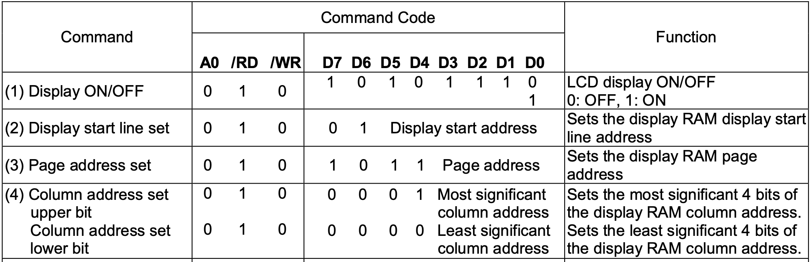
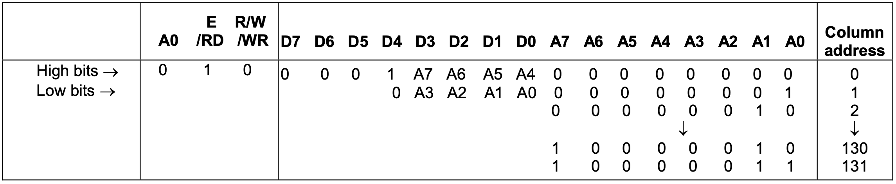
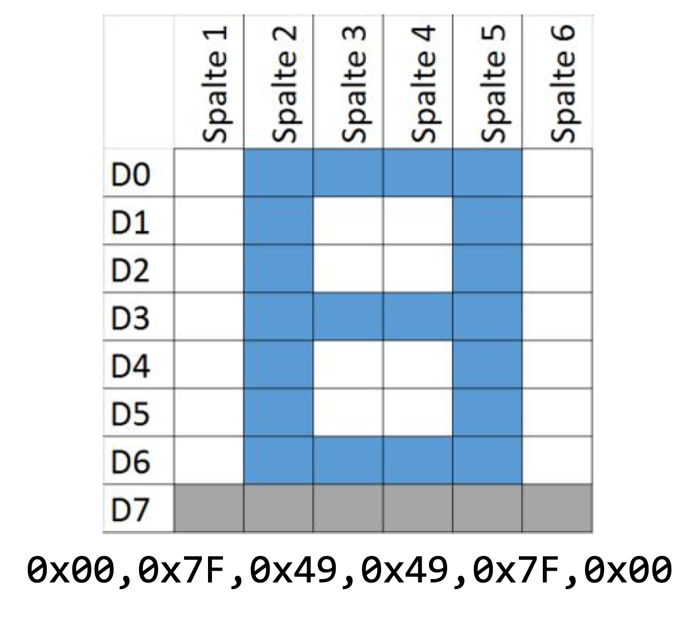

[⬅ Zurück zur Kapitelübersicht](../README.md#kapitelübersicht--aufgabenstellungen)

## Inhalt
- [Funktionen des Displays](#funktionen-des-displays)
- [Display Driver](#display-driver)
- [Fast Display Driver (optional)](#fast-display-driver-optional)

**Laborübung**

- *MSP430x5xx and MSP430x6xx Family User Guide Rev. O* – Texas Instruments  
  Kapitel 37: [USCI – SPI Mode](https://e2e.ti.com/cfs-file/__key/communityserver-discussions-components-files/166/MSP430x6-Family-User-Guide.pdf#page=968)

- [ST7565 65 x 132 Dot Matrix LCD Controller Datasheet – ST7565.pdf* **[ver 1.0a]**](https://www.hpinfotech.ro/ST7565.pdf)
  - Seite 7: [Block Diagram](https://www.hpinfotech.ro/ST7565.pdf#page=7)
  - Seiten 12–15: [MPU-Interface](https://www.hpinfotech.ro/ST7565.pdf#page=12)
  - Seite 16: [Font Definition](https://www.hpinfotech.ro/ST7565.pdf#page=16)
  - Seiten 32–41: [Commands](https://www.hpinfotech.ro/ST7565.pdf#page=32)

- Crazy Car Controller FHJ Schaltplan [Crazy Car Schematic](https://fhjoanneum-my.sharepoint.com/:b:/g/personal/florian_mayer_fh-joanneum_at/EfXYu-rqsLRErJbybsbN4AEB_RUMizJhwpb5D_ysimZehA?e=Ti7PtO)

**Wissensüberprüfung**

- *ST7565 65 x 132 Dot Matrix LCD Controller Datasheet – ST7565.pdf*
  - Seite 13: Serial Interface – [MPU-Interface](https://www.hpinfotech.ro/ST7565.pdf#page=13)
  - Seite 15: [Display Data RAM](https://www.hpinfotech.ro/ST7565.pdf#page=15)
  - Seite 16: [Font Definition](https://www.hpinfotech.ro/ST7565.pdf#page=16)

**Video**
  - [Einführungsvideo - Einheit 6](https://youtu.be/G8C0EL8kqp4?si=TPy8Cg725r3oyRdq)

### Durchzuführende Aufgaben
- [[AUFGABE] LCD Treiber Implementierung](#aufgabe-durchzuführende-arbeit--dokumentation-für-die-überprüfung-der-meilensteine)
  

---

## Funktionen des Displays

Das Display besitzt eine Auflösung von 128×64 Pixel. Jeder einzelne Pixel kann ein- oder ausgeschaltet werden. Eine einfache Datenübertragung mittels SPI reicht jedoch nicht aus, um Inhalte korrekt auf dem Display darzustellen. 

Es muss nicht nur zwischen Kommando- und Datenmodus umgeschaltet werden (mittels des **A0-Bits** – auch D/C genannt), sondern auch eine Initialisierung des Displays erfolgen. Ebenso muss das Kommunikationsinterface des Displays aktiviert werden, insbesondere durch korrektes Setzen der Chip-Select-Leitung (CS). 

Der A0-Pin steuert, ob das ankommende Byte als **Befehl** (A0 = 0) oder als **Darstellungsdaten** (A0 = 1) interpretiert wird.

<p align="center">
  
</p>

Diese sollten als `#define`-Makros in der Header-Datei abgelegt werden:

```c
#define LCD_RESET         0xE2
#define LCD_BIAS          0xA3
#define ADC_SEL_NORMAL    0xA0
#define COMMON_REVERSE    0xC8
#define RES_RATIO         0x24
#define ELEC_VOL_MODE     0x81
#define ELEC_VOL_VALUE    0x0F  // Kontrast-Einstellung
#define POWER_CONT        0x2F
#define DISPLAY_ON        0xAF
```

### Wichtige Makros zur SPI-Steuerung

```c
#define LCD_DATA    (P8OUT = (P8OUT | LCD_DATACMD))     // A0 = 1 → Datenmodus
#define LCD_COMMAND (P8OUT = (P8OUT & ~LCD_DATACMD))    // A0 = 0 → Kommandomodus
```

Warten auf abgeschlossene SPI-Übertragung:
```c
while (LCD_Data.Status.B.TxSuc == 0);
```

---

## Display Driver

Das Display ist elektrisch mit der SPI-Schnittstelle des Mikrocontrollers verbunden. Die Funktionen für die Datenübertragung über SPI [aus Übung 5](../Kapitel_05_SPI/README.md) werden im Display-Treiber aufgerufen.

Im Folgenden sind die Low-Level-Treiberfunktionen beschrieben, die mindestens erforderlich sind.

### [AUFGABE] Durchzuführende Arbeit & Dokumentation für die Überprüfung der Meilensteine

1. **Neues Treibermodul erstellen:** `driver_lcd.c`, `driver_lcd.h` und korrekt in das Projekt einbinden.

2. **Funktion `dl_LCDWriteCommand()` implementieren:**

```c
void dl_LCDWriteCommand(unsigned char *data , unsigned char data_length)
{
    unsigned char i;
    while(LCD_Data.Status.B.TxSuc == 0);
    LCD_COMMAND;

    for(i=0; i< data_length; i++)
    {
        LCD_Data.TxData.Data[i] = *data;
        data++;
    }

    LCD_Data.TxData.len = data_length;
    LCD_Data.TxData.cnt = 0;
    hal_USCIB1Transmit();
}
```

3. **Funktion `dl_LCDInit()` programmieren:**

```c
void dl_LCDInit(void)
{
  LCD_BACKLIGHT_ON;
  LCD_RESET_LOW;
  __delay_cycles(500000);
  LCD_RESET_HIGH;

  unsigned char init_seq[9] = {
    LCD_RESET, LCD_BIAS, ADC_SEL_NORMAL, COMMON_REVERSE,
    RES_RATIO, ELEC_VOL_MODE, ELEC_VOL_VALUE, POWER_CONT, DISPLAY_ON
  };
  dl_LCDWriteCommand(init_seq, sizeof(init_seq));

  dl_LCDClear();
}
```

> Tipp: Führen Sie einen Display-Test am Ende der Initialisierung durch, indem Sie alle Pixel aktivieren. Damit lässt sich überprüfen, ob das Display korrekt funktioniert.

4. **Funktion `dl_LCDSetPosition()` programmieren:**

```c
void dl_LCDSetPosition(unsigned char page, unsigned char col)
{
  unsigned char cmd[3];
  cmd[0] = 0xB0 | (page & 0x0F);                 // Page address
  cmd[1] = 0x10 | ((col >> 4) & 0x0F);           // Column address MSB
  cmd[2] = 0x00 | (col & 0x0F);                  // Column address LSB

  dl_LCDWriteCommand(cmd, 3);
}
```

<p align="center">
  
</p>

5. **Funktion `dl_LCDClear()` programmieren:**

```c
void dl_LCDClear(void)
{
  unsigned char i, j;
  unsigned char clear_data[128];

  for (i = 0; i < 128; i++) clear_data[i] = 0x00;

  for (j = 0; j < 8; j++) {
    dl_LCDSetPosition(j, 0);
    dl_LCDWriteData(clear_data, 128);
  }
}
```

6. **Font Table erstellen / übernehmen:**

```c
const unsigned char font_table[128][5] = {
  // ASCII-Werte ab 32 (Leerzeichen)
  {0x00, 0x00, 0x00, 0x00, 0x00}, // Space
  {0x00, 0x00, 0x5F, 0x00, 0x00}, // !
  ...
};
```
<p align="center">
  
</p>
7. **Funktion `dl_LCDWriteText()` programmieren:**

  ```c
  void dl_LCDWriteText(char *text , unsigned char text_length , unsigned char page , unsigned char col)
  {
    unsigned char i, text_length_cnt, col_pos = col;
    // Dislay Cursor setzen     
    // Wait for Display
    // Auf Datenmodus wechseln

    for(text_length_cnt=0;text_length_cnt < text_length; text_length_cnt++) 
    // Textlänge des Strings abarbeiten
    {
        for(i=0; i < fonts_width_max; i++) // Jedes Character des Strings
        {
            LCD_Data.TxData.Data[i] = font_table[*text][i];
            col_pos++;
        }

      // Daten an das Display senden // Warten bis Übertragung fertig ist
      // Column „overflow“?
      // Einfügen einer Abfrage ob das Ende der Page erreicht ist
      text++;
    }
  }
```

8. **Funktion `dl_LCDWriteUInt()` programmieren:**

  Diese Funktion soll ähnlich wie `dl_LCDWriteText()` arbeiten. Hierzu muss die positive Integer-Zahl zuerst in einen Text umgewandelt werden, bevor sie an das Display gesendet wird. Die `dl_LCDWriteText()`-Funktion kann dabei wiederverwendet werden.

---

## Fast Display Driver (optional)

Zur Entlastung der CPU kann ein sogenanntes "Display RAM" implementiert werden – ein zweidimensionales Array, das den Displayinhalt vollständig abbildet. 

Displayausgaben (z. B. `WriteText`, `WriteUInt`) schreiben dann nicht mehr direkt ans Display, sondern nur in dieses RAM. Die Aktualisierung erfolgt gesammelt mittels DMA über SPI.

**Nachteil:** Das Grafik-RAM benötigt viel Speicherplatz und kann je nach Mikrocontroller kritisch sein.

```c
unsigned char display_ram[8][128];
```

Aktualisierung:
```c
void dl_LCDUpdate(void)
{
  for (unsigned char page = 0; page < 8; page++) {
    dl_LCDSetPosition(page, 0);
    dl_LCDWriteData(display_ram[page], 128);
  }
}
```

## Referenzen

- **MSP430x5xx and MSP430x6xx Family User Guide**, Texas Instruments, Literature Number: SLAU208O, Rev. O, April 2019.  
  Verfügbar unter: [https://www.ti.com/lit/pdf/slau208](https://www.ti.com/lit/pdf/slau208)

- **MSP430F5335 Datasheet**, Texas Instruments, Document Number: SLAS590N, Rev. N, October 2018.  
  Verfügbar unter: [https://www.ti.com/lit/gpn/msp430f5335](https://www.ti.com/lit/gpn/msp430f5335)

- John H. Davies, **MSP430 Microcontroller Basics**, Newnes/Elsevier, ISBN 978‑0‑7506‑8276‑3.  

[⬆ Zurück zum Hauptverzeichnis](../README.md#kapitelübersicht--aufgabenstellungen)
