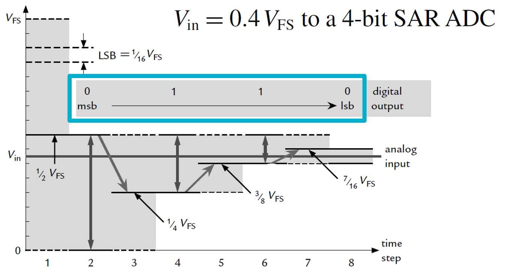
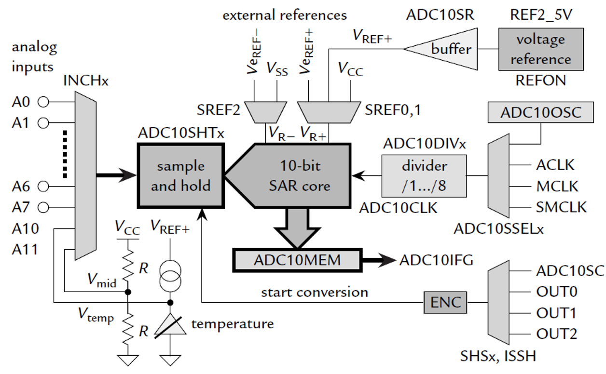

[⬅ Zurück zur Kapitelübersicht](../README.md#kapitelübersicht--aufgabenstellungen)

## Inhalt
- [Theorie: ADC – Analoger Digitalwandler (MSP430)](#theorie-adc--analoger-digitalwandler-msp430)
- [Funktionsweise des ADC12](#funktionsweise-des-adc12)
- [Blockdiagramm](#blockdiagramm)
- [Ergebnisregister – ADC12MEMx](#ergebnisregister--adc12memx)

**Laborübung**

- *MSP430x5xx and MSP430x6xx Family User Guide Rev. O* – Texas Instruments
  - Kapitel 28: [ADC12_A](https://e2e.ti.com/cfs-file/__key/communityserver-discussions-components-files/166/MSP430x6-Family-User-Guide.pdf#page=732)

- Crazy Car Controller FHJ Schaltplan [Crazy Car Schematic](https://fhjoanneum-my.sharepoint.com/:b:/g/personal/florian_mayer_fh-joanneum_at/EfXYu-rqsLRErJbybsbN4AEB_RUMizJhwpb5D_ysimZehA?e=Ti7PtO)

**Wissensüberprüfung**

- *MSP430x5xx and MSP430x6xx Family User Guide Rev. O* – Texas Instruments
  - Kapitel 28.1: [Introduction](https://e2e.ti.com/cfs-file/__key/communityserver-discussions-components-files/166/MSP430x6-Family-User-Guide.pdf#page=733)
  - Kapitel 28.1: Figure 28-1 – [ADC12 Block Diagram](https://e2e.ti.com/cfs-file/__key/communityserver-discussions-components-files/166/MSP430x6-Family-User-Guide.pdf#page=734)
  - Kapitel 28.2.7.1 – 28.2.7.4: [Funktionsweise der Modi](https://e2e.ti.com/cfs-file/__key/communityserver-discussions-components-files/166/MSP430x6-Family-User-Guide.pdf#page=741)
  - Zusammenhang: Bit-Auflösung, Referenzspannung, maximale Eingangsspannung

> **!! Eigener Taschenrechner für Wissensüberprüfung !!**

**Video**
  - [Langes Einführungsvideo - Einheit 7](https://youtu.be/0CFYmttqxME?si=QsjtS0B0d8GcQTu0)

### Durchzuführende Aufgaben
- [[AUFGABE] Konfiguration ADC12](#aufgabe-durchzuführende-arbeit--dokumentation-für-die-überprüfung-der-meilensteine)

## Theorie: ADC – Analoger Digitalwandler (MSP430)

Der MSP430 besitzt einen 12 Bit SAR-ADC (Successive Approximation Register ADC). Damit lassen sich analoge Spannungen in digitale Werte zwischen 0 und 4095 umwandeln, wobei die Genauigkeit durch die Referenzspannung bestimmt wird. Das Eingangssignal wird dabei über einen Multiplexer an einen internen Sample-and-Hold-Kreis geführt, bevor es vom SAR-Wandler verarbeitet wird.

<p align="center">
  
</p>

### Funktionsweise des ADC12

- **Sample & Hold**: Das Eingangssignal wird über einen analogen Multiplexer auf einen Kondensator geschaltet (vgl. Datenblatt: Figure 28-6). Dieser stellt ein RC-Tiefpassfilter dar. Während der **Sample-Zeit (SAMPCON = High)** wird der Kondensator geladen. Danach wird der Kanal getrennt (**Hold-Zeit, SAMPCON = Low**) und die Wandlung beginnt.

- **Wandlungszeit**: Die Umwandlung erfolgt in 13 Taktzyklen (ADC12CLK). Die gewählte Taktquelle und Frequenz beeinflussen die Dauer.

- **Triggerung**: Der ADC kann durch interne oder externe Trigger gestartet werden (Timer, Software, etc.). Über `ADC12SHSx` lässt sich die Triggerquelle festlegen (vgl. Figure 28-2).

- **Auflösung**: Die 12-Bit-Auflösung ergibt ${2^{12}} = 4096$ Stufen. Die tatsächliche Spannungsauflösung hängt von der Referenzspannung ab: 
$$\text{LSB} = \frac{V_{REF}}{2^{12}}$$

- Die Abtastung kann durch verschiedene Quellen getriggert werden, etwa durch einen Timer (ADC12SHSx = 01), wobei der ADC12 selbst dann eine komplette Sequenz starten kann.

### Blockdiagramm
<p align="center">
  
</p>

### Ergebnisregister – ADC12MEMx

Der ADC besitzt 16 Ergebnisregister: `ADC12MEM0` bis `ADC12MEM15`. Jedes Register speichert das Ergebnis eines bestimmten Kanals.  
Wird z. B. Kanal A0 konvertiert, landet das Ergebnis in `ADC12MEM0`, A1 in `ADC12MEM1` usw.

Bei Verwendung mehrerer Kanäle (z. B. Sensor vorne, links, rechts, VBAT) sollte klar sein, dass jeder Kanal sein eigenes Ergebnisregister besitzt und diese **nicht von anderen Kanälen überschrieben werden**, solange die Konfiguration korrekt ist. Dadurch können mehrere Messwerte pro Wandlungszyklus parallel gespeichert und anschließend ausgelesen werden.

### Beispiel:
```c
unsigned short sensor_front = ADC12MEM0;
unsigned short sensor_left  = ADC12MEM1;
unsigned short sensor_right = ADC12MEM2;
unsigned short vbat         = ADC12MEM3;
```

## [AUFGABE] Durchzuführende Arbeit & Dokumentation für die Überprüfung der Meilensteine

1. **Neues HAL-Modul erstellen**: `hal_adc12.c` und `hal_adc12.h`

2. **GPIO Konfiguration**: Die benötigten Pins (z. B. `P6.0` für `A0`, `P6.1` für `A1`, etc.) im `hal_gpio.c` als analoge Eingänge konfigurieren (Bit `PxSEL` setzen, ggf. `PxDIR`, `PxREN` deaktivieren).

3. **Timer B0 konfigurieren**: Erzeugen Sie einen Trigger für den ADC, z. B. über `OUTMOD_4` (Toggle/Reset) mit einer Frequenz von 120 Hz. Die Verbindung zum ADC erfolgt über das Register `ADC12SHSx`.

4. **Funktion `hal_ADC12Init(void)` programmieren**:

- `ADC12CTL0`: Aktivieren des ADC, Wahl der Sample-&-Hold-Zeit (z. B. `SHT0_8`) und Multiplexer-Steuerung
- `ADC12CTL1`: Taktquelle (`ADC12SSELx`), Taktteilungsfaktor (`ADC12DIVx`), Wandlungsmodus (z. B. `ADC12CONSEQ_1` für Sequenz)
- `ADC12CTL2`: Auflösung (`ADC12RES_2` für 12 Bit)
- `ADC12MCTLx`: Kanal- und Referenzspannungseinstellung (z. B. `ADC12INCH_0`, `VR+ = AVCC`, `VR- = AVSS`)
- `ADC12IE`: Interrupts für die gewünschten Kanäle aktivieren


5. **Typedef für Datenstruktur `ADC12Com` in `hal_adc12.h` anlegen:**

```c
typedef struct {
  union {
    unsigned char R;
    struct {
      unsigned char ADCrdy:1; // Bit = 1, wenn Daten bereit sind
      unsigned char dummy:7;
    } B;
  } Status;

  union {
    unsigned short ADCBuffer[4];
    struct {
      unsigned short SensorLeft;
      unsigned short SensorRight;
      unsigned short SensorFront;
      unsigned short VBat;
    } Sensor;
  } Data;

} ADC12Com;
```
- **`Status.R`**  
  Zugriff auf das gesamte Statusregister als Byte, z. B. zum Zurücksetzen aller Statusbits auf einmal.

- **`Status.B.ADCrdy`**  
  Zugriff auf ein einzelnes Bit im Statusregister – hier zur gezielten Abfrage, ob neue ADC-Daten verfügbar sind.

6. **Globale Variable vom Typ `ADC12Com` in `hal_general.c` definieren:**
```c
ADC12Com ADC12Data;
```

7. **Variable in `main.c` und `hal_usciB1.c` als extern deklarieren:**
```c
extern ADC12Com ADC12Data;
```

8. **ISR vorbereiten:**
```c
#pragma vector = ADC12_VECTOR
__interrupt void ADC12_ISR(void)
{
  // Gesampelte Daten aus den ADC12MEMx-Regs auslesen
  // In Datenstruktur ADC12Data.Data.Sensor.* schreiben
  // ADC12Data.Status.B.ADCrdy = 1 setzen
}
```

9. **Datenverarbeitung in der Hauptschleife**

In der `while(1)`-Schleife:
- Auf `ADC12Data.Status.B.ADCrdy` prüfen
- Wenn gesetzt, Werte ans Display ausgeben
- Anschließend Flag rücksetzen (`ADCrdy = 0`)

## Referenzen

- **MSP430x5xx and MSP430x6xx Family User Guide**, Texas Instruments, Literature Number: SLAU208O, Rev. O, April 2019. Verfügbar unter: [https://www.ti.com/lit/pdf/slau208](https://www.ti.com/lit/pdf/slau208)

- **MSP430F5335 Datasheet**, Texas Instruments, Document Number: SLAS590N, Rev. N, October 2018. Verfügbar unter: [https://www.ti.com/lit/gpn/msp430f5335](https://www.ti.com/lit/gpn/msp430f5335)

- John H. Davies, **MSP430 Microcontroller Basics**, Newnes/Elsevier, ISBN 978‑0‑7506‑8276‑3.  

[⬆ Zurück zum Hauptverzeichnis](../README.md#kapitelübersicht--aufgabenstellungen)
