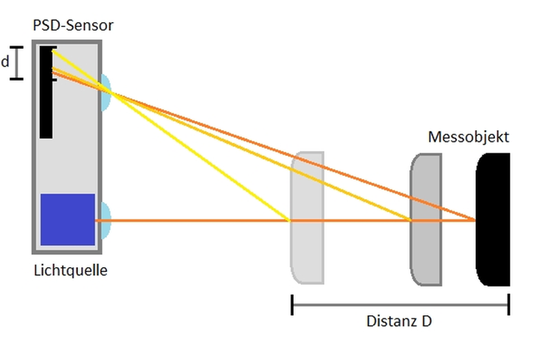
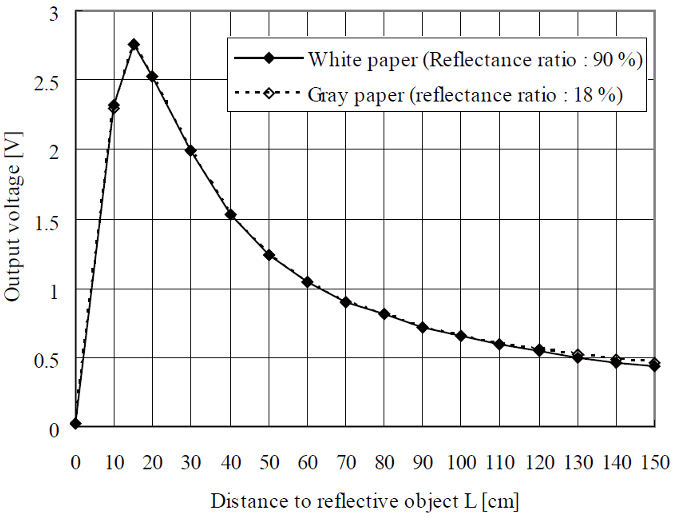

[⬅ Zurück zur Kapitelübersicht](../README.md#kapitelübersicht--aufgabenstellungen)

# Sharp Abstandssensoren

## Inhaltsverzeichnis
* [Funktionsprinzip: Triangulation bei Sharp-Sensoren](#funktionsprinzip-triangulation-bei-sharp-sensoren)
* [Sensor-Kennlinie](#sensor-kennlinie)
* [Messung der Ausgangskennlinie](#messung-der-ausgangskennlinie)
* [Analyse mit dem Oszilloskop](#analyse-mit-dem-oszilloskop)
* [Linearisierung](#linearisierung)
  * [1) Mathematische Annäherung](#1-mathematische-annäherung)
  * [2) Lookup Table](#2-lookup-table)
* [Globale Speicherung der Werte](#globale-speicherung-der-werte)

## Inhalt

**Laborübung**

* [Sharp GP2Y0A02YK0F Datasheet](./GP2Y0A02YK0F.pdf)
* Crazy Car Controller FHJ Schaltplan

**Wissensüberprüfung**
- Triangulation 
- Velocity (Physics) 

* [Application Note](./GP2Y0A02YK0F.pdf#page=1)
  * [Timing Chart (Sample Time vs. Output Stability)](./GP2Y0A02YK0F.pdf#page=4)
  * [Distance Characteristics](./GP2Y0A02YK0F.pdf#page=4)

> Tipp: Multimeter, Oszilloskop und Taschenrechner bereithalten.

### Durchzuführende Aufgaben
[[AUFGABE] Implementierung Distanzmessung](#aufgabe-durchzuführende-arbeiten--dokumentation-für-die-meilensteinüberprüfung)

---

## Funktionsprinzip: Triangulation bei Sharp-Sensoren

Sharp-IR-Sensoren arbeiten nach dem **Prinzip der optischen Triangulation**. Sie enthalten:

* Eine **Infrarot-LED**, die einen Strahl aussendet
* Einen **Position Sensitive Detector (PSD)** mit einer Linse
* Eine interne Analogschaltung zur Umrechnung

### Grundidee:

Der reflektierte IR-Strahl trifft je nach Abstand an einer unterschiedlichen Position auf den PSD.
Daraus ergibt sich eine **nichtlineare, umgekehrt proportionale** Beziehung zwischen der **Ausgangsspannung** und dem **Abstand zum Objekt**.

<p align="center">
  
</p>

> **Der Sensor funktioniert nur korrekt bei diffus reflektierenden Objekten!**

## Sensor-Kennlinie

Vor dem Einsatz im Regelkreis muss die **Sensorcharakteristik** getestet werden:

* Versorgungsspannung: 5 V
* Ausgangsspannung: 0.4–2.8 V (typisch)
* Abstand: 10–80 cm (modellabhängig)
* Frequenz: ~25–40 Hz (Signalstabilität)

---

## Messung der Ausgangskennlinie

1. **Abstand vs. Spannung messen**

   * Multimeter verwenden
   * Abstand in 5 cm-Schritten erhöhen
   * Ausgangsspannung notieren

2. **Kennlinie grafisch darstellen**

   * X-Achse: Abstand (mm)
   * Y-Achse: Ausgangsspannung (mV)
   * Vergleich mit:

<p align="center">
  
</p>

## Analyse mit dem Oszilloskop

* Ausgangssignal ist **analog**, aber **nicht stabil** bei hohen Frequenzen.
* Überprüfen Sie:

  * Störspannungen
  * Wiederholrate des Signals
  * Stabilität über Zeit

> Ergebnis: **Keine echte Linearität**, aber deterministische Kennlinie.

---

## Linearisierung

Ein linearer Zusammenhang ist essenziell für gleichmäßige Steuerung.
Zwei etablierte Methoden:

### 1) Mathematische Annäherung

* Invers-polynomiale oder exponentielle Approximation
* Basierend auf Fit der empirischen Kennlinie

```c
// Beispiel: Näherungsfunktion
uint16_t convertIR(uint16_t adcVal) {
    float voltage = (adcVal / 4095.0f) * 3.3f;
    float dist_cm = 4800.0f / (voltage * 1000.0f);
    return (uint16_t)(dist_cm * 10); // Rückgabe in mm
}
```

> Für präzisere Ergebnisse: **Polynomanpassung (polyfit, MATLAB)**

* Betrachten Sie das bereitgestellte MATLAB-Skript:
`polynomial_ES.m` (im Ordner)

---

### 2) Lookup Table

* Vorteil: Keine Berechnung zur Laufzeit
* Aufbau: `adcValue` → `Distance_mm`
* Reduktion durch Shift: z. B. `adc >> 3` bei 512-Einträgen

```c
#define ADC_RESOLUTION 4096
#define LUT_SIZE 512

const uint16_t distTableFront[LUT_SIZE] = { /* aus Interpolation */ };

uint16_t getDistanceFront(uint16_t adcVal) {
    return distTableFront[adcVal >> 3];
}
```

* Interpolation zur Tabellen-Erstellung:
Nutzen Sie `polynomial_ES.m` mit ADC-Werten und gemessenen Distanzen.
Exportiere das Ergebnis als C-Array.

---

## Globale Speicherung der Werte

Erstellen Sie ein separates **DL-Modul**, z. B. `dl_ir.c`.
Dieses übernimmt die Abfrage des ADCs und speichert die linearisierte Distanz:

```c
typedef struct {
    uint16_t Front_mm;
    uint16_t Side_mm;
} irData_t;

extern irData_t g_irData;
```

## [AUFGABE] Durchzuführende Arbeiten & Dokumentation für die Meilensteinüberprüfung

1. **Grundlagenstudium**
   - Lesen Sie die Application Note und das Datasheet (`GP2Y0A02YK0F.pdf`)
   - Verstehen des Triangulationsprinzips 

2. **Kennlinienerfassung**
   - Messen Sie die Ausgangsspannung des IR-Sensors in Abhängigkeit vom Abstand (10 cm bis 80 cm in 5 cm-Schritten)
   - Stellen Sie die gemessene Kennlinie grafisch dar
   - Vergleichen Sie Ihre Ergebnisse mit dem Diagramm auf Seite 5 des Datenblattes

3. **Analyse mit dem Oszilloskop**
   - Untersuchen Sie das Sensorsignal auf Schwankungen, Frequenz und Stabilität
   - Dokumentieren Sie Auffälligkeiten und Frequenzverhalten

4. **Linearisierung der Kennlinie**
   - Erstellen Sie eine mathematische Näherung (z. B. polynomiell) oder nutzen Sie eine Lookup-Tabelle
   - Wenn Sie die Lookup-Tabelle verwenden, wählen Sie eine sinnvolle Auflösung (zB. 512 Einträge → `adc >> 3`)
   - Verweisen Sie auf den MATLAB-Code `polynomial_ES.m` zur Interpolation

5. **Implementierung im Code**
   - Erstellen Sie ein neues Modul `dl_ir.c` im Driver Layer
   - Erfassen Sie die ADC-Werte und wandeln Sie diese in Millimeterwerte um
   - Speichern Sie die linearen Werte in einer globalen Struktur wie `g_irData`

## Referenzen

* **GP2Y0A02YK0F Datasheet**, Sharp Corp.
  (Datei: `GP2Y0A02YK0F.pdf`)
* **MSP430x5xx and MSP430x6xx Family User Guide**, TI, SLAU208O
  [https://www.ti.com/lit/pdf/slau208](https://www.ti.com/lit/pdf/slau208)

[⬆ Zurück zum Hauptverzeichnis](../README.md#kapitelübersicht--aufgabenstellungen)