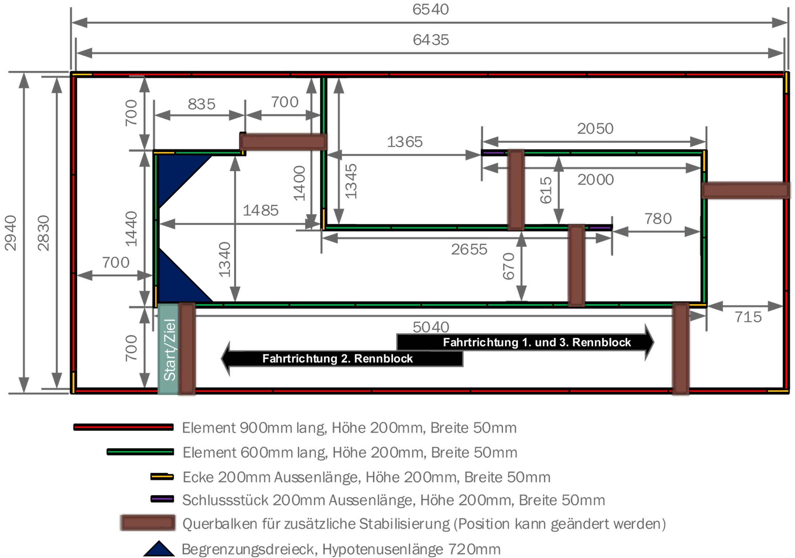
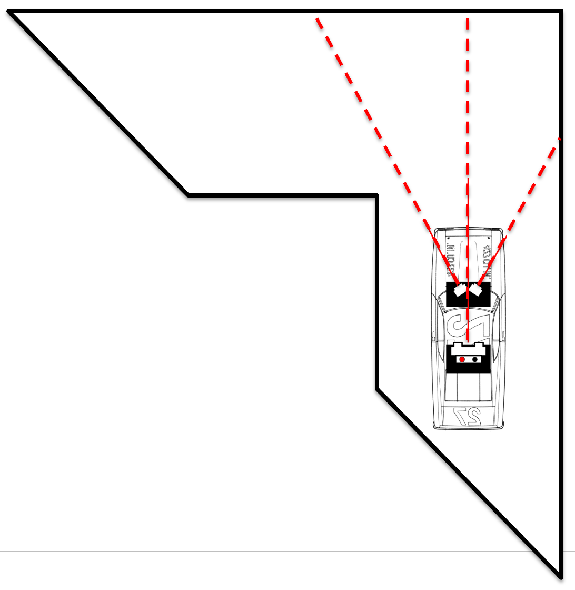
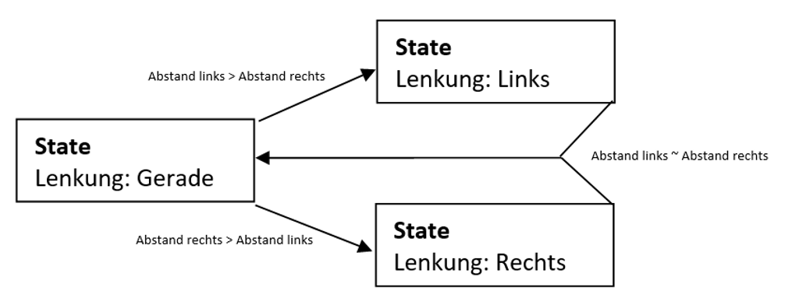

[⬅ Zurück zur Kapitelübersicht](../README.md#kapitelübersicht--aufgabenstellungen)

# Fahralgorithmen
## Inhaltsverzeichnis
- [Sensorik](#sensorik)
  - [Abstandssensoren](#abstandssensoren)
  - [Drehzahlsensor](#drehzahlsensor)
  - [9-Achsen Bewegungssensor](#9-achsen-bewegungssensor)
- [Signalverarbeitung und Filterung](#signalverarbeitung-und-filterung)
- [Regelung und Entscheidungslogik](#regelung-und-entscheidungslogik)
  - [Zustandsautomat (FSM)](#zustandsautomat-fsm)
  - [PID-Regelung](#pid-regelung)
- [Simulator für Test und Entwicklung](#simulator-für-test-und-entwicklung)
- [Durchzuführende Arbeiten](#durchzuführende-arbeiten)

---

## Video
- [Crazy Car Algorithmic Video](https://youtu.be/BgQ-2mav-24?si=Hhmz0GyEwqejlKwW)

## Inhalt

Ziel der folgenden Laborübung ist es, das Fahrzeug auf einer vorgegebenen Strecke **autonom** fahren zu lassen. Im Vordergrund steht dabei **Zuverlässigkeit**, nicht Geschwindigkeit.

Die Fahralgorithmen basieren auf Sensorwerten und implementieren eine Regelungs- bzw. Entscheidungslogik zur Fahrbahnverfolgung.

> Weitere Informationen zum Bewerb, Reglement und Anmeldung:
[Crazy Car Projektseite](https://fh-joanneum.at/projekt/crazycar)

> **!!!! Rennen:** Das Rennen findet am 29.01.2026 – im Audimax Graz statt

<p align="center">
  
</p>

## Sensorik

### Abstandssensoren

Sharp-Sensoren ermöglichen eine Distanzmessung zur Bande oder zu Hindernissen.  
Dabei sind folgende Aspekte zu beachten:

- **Lichtempfindlichkeit**: Direkte Lichteinstrahlung kann Messwerte verfälschen  
- **Montagewinkel**: Flachere Winkel verbessern die Sicht in Kurven, verschlechtern aber Hinderniserkennung
- **Nichtlinearität**: → Linearisierung notwendig (siehe eigenes Kapitel)

<p align="center">
  
</p>

### Messwert-Glättung mit Moving Average

```c
#define BUFFER_SIZE 5
uint16_t buffer[BUFFER_SIZE];
uint8_t index = 0;

uint16_t updateMovingAverage(uint16_t newVal) {
    buffer[index++] = newVal;
    if (index >= BUFFER_SIZE) index = 0;
    
    uint32_t sum = 0;
    for (int i = 0; i < BUFFER_SIZE; i++) {
        sum += buffer[i];
    }
    return (uint16_t)(sum / BUFFER_SIZE);
}
```

> ⚠ Ein zu großer Filterpuffer kann zu träger Reaktion führen!

---

### Drehzahlsensor

Die Fahrleistung hängt stark von der realen Drehzahl ab. Zwei Optionen:

- **Indirekt über Akkuspannung** (ungenau, nicht empfohlen)
- **Direkt über Sensor** (z. B. optischer Encoder am Rad)

Zusätzlich kann die Drehzahlmessung als Grundlage für eine **Wegmessung** dienen.

```c
volatile uint16_t g_wheelTicks = 0;

void PORT1_IRQHandler(void) {
    if (P1IFG & BIT4) {
        g_wheelTicks++;
        P1IFG &= ~BIT4;
    }
}
```

---

### 9-Achsen Bewegungssensor

Ein Inertialsensor (IMU) bietet:

- Beschleunigung (X/Y/Z)
- Gyro (Drehrate)
- Magnetfeld (Orientierung)

💡 Im Rennen **erlaubt**, jedoch in der Laborübung **nicht verpflichtend**.  
Für fortgeschrittene Teams zur Navigationserweiterung empfohlen.

---

## Signalverarbeitung und Filterung

Die Signalqualität entscheidet maßgeblich über die Systemstabilität.

**Typische Filter:**
- **Moving Average** (wie oben gezeigt)
- **Median-Filter** (zur Ausreißerunterdrückung)
- **Low-Pass-Filter (LPF)** (digital rekursiv)

```c
float lpf(float prev, float current, float alpha) {
    return alpha * current + (1.0f - alpha) * prev;
}
```

---

## Regelung und Entscheidungslogik

### Zustandsautomat (FSM)

Ein klassischer Ansatz zur Strukturierung des Fahrverhaltens:

```c
typedef enum {
    STATE_IDLE,
    STATE_FOLLOW_LINE,
    STATE_OBSTACLE_LEFT,
    STATE_OBSTACLE_RIGHT,
    STATE_FINISHED
} driveState_t;

driveState_t currentState = STATE_IDLE;

void updateState(uint16_t distL, uint16_t distR) {
    switch (currentState) {
        case STATE_IDLE:
            if (distL < 800 && distR < 800)
                currentState = STATE_FOLLOW_LINE;
            break;
        case STATE_FOLLOW_LINE:
            if (distL > 1200)
                currentState = STATE_OBSTACLE_RIGHT;
            else if (distR > 1200)
                currentState = STATE_OBSTACLE_LEFT;
            break;
        // Weitere Zustände
    }
}
```

<p align="center">
  
</p>

---

### PID-Regelung

Zur Feinanpassung der Fahrspur, z. B. basierend auf **Seitenabstandsdifferenz**:

```c
float Kp = 1.2f, Ki = 0.1f, Kd = 0.05f;
float integral = 0.0f, prevError = 0.0f;

int16_t pidControl(int16_t setpoint, int16_t measured) {
    float error = setpoint - measured;
    integral += error;
    float derivative = error - prevError;
    prevError = error;

    return (int16_t)(Kp * error + Ki * integral + Kd * derivative);
}
```

Der PID-Ausgang kann z. B. das PWM-Signal für die **Lenkung** oder **Drehzahl** anpassen.

---

## Simulator für Test und Entwicklung

Ein **Open-Source-Simulator** wurde für die Studierenden entwickelt:  
**CrazyCarSim**: [https://github.com/Electronic-and-Computer-Engineering/CrazyCarSim](https://github.com/Electronic-and-Computer-Engineering/CrazyCarSim)

Features:

- Simulierte Sensorwerte (IR, Drehzahl)
- Konfigurierbare Streckenführung
- Integration eigener Algorithmen
- Echtzeit-Auswertung und Visualisierung

> Empfohlen zur Validierung der Algorithmen **vor dem Einsatz auf echter Hardware**.

---

## Durchzuführende Arbeiten für Meilensteine bzw. den CrazyCar Bewerb

1. **Sensorwerte filtern**
   - Implementieren Sie einen Moving-Average- oder Low-Pass-Filter

2. **Fahrzustände identifizieren**
   - Definieren Sie geeignete Zustände (z. B. Geradeaus, Kurve, Hindernis)
   - Implementieren Sie eine Zustandslogik

3. **Lenkregelung**
   - Entwickeln Sie eine einfache PID- oder differenzbasierte Steuerung

4. **Simulator verwenden**
   - Testen Sie Ihre Logik vorab im CrazyCarSim
   - Dokumentieren Sie Ihre Ergebnisse und Strategien

5. **Code strukturieren**
   - Verwenden Sie sinnvolle Module: z. B. `ctrl_drive.c`, `ctrl_sensor.c`

6. **Dokumentation**
   - Erklären Sie Ihre Strategie, Zustände und Entscheidungen nachvollziehbar

---

## Referenzen

- **MSP430x5xx and MSP430x6xx Family User Guide**, Texas Instruments, Literature Number: SLAU208O, Rev. O, April 2019.  
  Verfügbar unter: [https://www.ti.com/lit/pdf/slau208](https://www.ti.com/lit/pdf/slau208)

- **MSP430F5335 Datasheet**, Texas Instruments, Document Number: SLAS590N, Rev. N, October 2018.  
  Verfügbar unter: [https://www.ti.com/lit/gpn/msp430f5335](https://www.ti.com/lit/gpn/msp430f5335)

- John H. Davies, **MSP430 Microcontroller Basics**, Newnes/Elsevier, ISBN 978‑0‑7506‑8276‑3.  

[⬆ Zurück zum Hauptverzeichnis](../README.md#kapitelübersicht--aufgabenstellungen)
